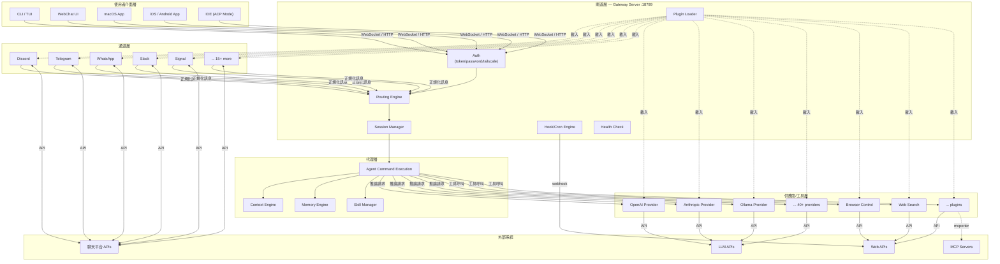

# 系統架構總覽 — OpenClaw 完整架構圖與敘述

> **摘要**：OpenClaw 是一個本地運行（local-first）的多通道 AI 閘道器（Multi-channel AI Gateway），以 Node.js/TypeScript 實作。它將使用者的各種聊天平台（Discord、Telegram、WhatsApp 等 20+ 個通道）統一接入一個 Gateway 伺服器，再由 Gateway 將訊息路由到配置好的 AI Agent，Agent 呼叫 LLM 並透過 Plugin 系統執行工具呼叫，最後將回應送回原始通道。整個系統採用 plugin-based、config-driven 的設計，核心保持精簡，所有可選能力（模型供應商、通道、工具）都以 Extension 形式載入。

---

## 1. OpenClaw 的定位：本地運行的多通道 AI 閘道器

OpenClaw 的自我定義非常明確。在其 README 中，它被描述為：

> "Multi-channel AI gateway with extensible messaging integrations"
>
> — `source-repo/package.json:4`

而在 VISION.md 中，設計哲學進一步闡述：

> "OpenClaw is the AI that actually does things. Runs on your devices, in your channels, with your rules."
>
> — `source-repo/VISION.md:1-3`

這兩句話精確地捕捉了 OpenClaw 的三個核心定位：

### 1.1 個人 AI 助理（Personal AI Assistant）

OpenClaw 不是一個面向企業的 SaaS 平台，而是一個**個人助理**。它跑在你自己的機器上、連接你自己的聊天帳號、使用你自己的 API key。整個系統的信任模型建立在「一個操作者控制一個 Gateway」的假設上（詳見 operator-session-model）。

### 1.2 多通道閘道器（Multi-channel Gateway）

OpenClaw 同時支援超過 20 個聊天平台：

```
WhatsApp、Telegram、Slack、Discord、Google Chat、Signal、
iMessage、BlueBubbles、IRC、Microsoft Teams、Matrix、Feishu、
LINE、Mattermost、Nextcloud Talk、Nostr、Synology Chat、
Tlon、Twitch、Zalo、WeChat、WebChat
```

> — `source-repo/README.md:4-6`

每個平台都是一個獨立的 Channel Extension（通道擴充），透過 Gateway 統一管理。同一個 Agent 可以同時服務多個通道，也可以為不同通道配置不同的 Agent。

### 1.3 可擴充的 AI 平台（Extensible AI Platform）

OpenClaw 的核心非常精簡。幾乎所有能力都以 Extension 形式載入：

- **模型供應商**（Model Providers）：OpenAI、Anthropic、Google、Groq、Ollama 等 40+ 個
- **通道**（Channels）：上述 20+ 個聊天平台
- **工具**（Tools）：瀏覽器控制、Web 搜尋、圖片生成、語音合成等
- **記憶**（Memory）：LanceDB、Wiki 等記憶引擎

```
source-repo/extensions/ 目錄下共有 121 個 extension
source-repo/skills/ 目錄下共有 53 個 skill
```

> — 統計自 `source-repo/extensions/` 和 `source-repo/skills/` 目錄

---

## 2. 核心元件如何組合為完整系統

以下是 OpenClaw 的核心元件及其職責：

### 2.1 Gateway（閘道伺服器）

Gateway 是整個系統的控制平面（Control Plane），負責：

- **網路監聽**：預設在 `127.0.0.1:18789` 上啟動 HTTP + WebSocket 伺服器
- **認證授權**：支援 token、password、Tailscale、device-token 等多種認證方式
- **Session 管理**：建立、維護、歸檔 Session
- **訊息路由**：將來自不同 Channel 的訊息路由到正確的 Agent
- **Channel 管理**：啟動和監控所有 Channel 連接
- **Plugin 載入**：發現、載入、啟用 Extension/Plugin
- **Hook/Cron**：處理 Webhook 回呼和定時任務
- **健康檢查**：提供 `/healthz` 端點

Gateway 的實作位於：

```typescript
// source-repo/src/gateway/server.impl.ts:109-129
// 啟動時建立多個子系統的 logger
const log = createLogger("gateway");
const canvasLog = createLogger("canvas");
const channelsLog = createLogger("channels");
const healthLog = createLogger("health");
const cronLog = createLogger("cron");
const hooksLog = createLogger("hooks");
const pluginsLog = createLogger("plugins");
```

### 2.2 Agents（AI 代理人）

Agent 是 OpenClaw 中執行 AI 對話的核心單元。每個 Agent 都有：

- **唯一 ID**：用於路由識別
- **模型配置**：指定使用哪個 LLM（可含 fallback 鏈）
- **工作空間**（Workspace）：獨立的檔案系統目錄
- **人格設定**（Identity）：系統提示詞、群聊行為
- **技能篩選**（Skills）：限定可用的技能集
- **記憶搜尋**（Memory Search）：是否啟用記憶系統
- **子代理**（Subagents）：允許產生子 Agent 的策略

```typescript
// source-repo/src/config/types.agents.ts:65-113
// Agent 配置結構（簡化版）
AgentConfig {
  id               // Agent 唯一識別碼
  default?         // 是否為預設 Agent
  name?            // 顯示名稱
  workspace?       // 工作空間路徑
  model?           // 模型參考（如 "openai:gpt-4o"）
  thinkingDefault? // 推理模式預設
  skills?          // 技能允許清單
  memorySearch?    // 記憶搜尋配置
  identity?        // 人格設定
  subagents?       // 子代理策略
  sandbox?         // 沙箱覆寫
  tools?           // 工具配置
  runtime?         // 運行時類型（embedded | acp）
}
```

> — `source-repo/src/config/types.agents.ts:65-113`

### 2.3 Channels（通道）

Channel 是 OpenClaw 與外部聊天平台之間的橋樑。每個 Channel 負責：

- 連接到外部平台（如 Discord Bot API）
- 接收訊息並正規化為統一格式
- 將 Agent 回應格式化為平台特定格式
- 管理 typing indicator、status reaction 等平台功能
- 處理 allowlist（允許清單）過濾

Channel 的註冊與管理透過一個 registry 模式實現：

```typescript
// source-repo/src/channels/registry.ts:20-46
// Channel 註冊表：透過 ID 或 alias 查找已註冊的 Channel Plugin
findRegisteredChannelPluginEntry()  // 以 ID 或 alias 查找
listRegisteredChannelPluginIds()     // 列出所有已註冊 ID
getRegisteredChannelPluginMeta()     // 取得元資料（alias、markdown 能力等）
```

> — `source-repo/src/channels/registry.ts:20-95`

Channel 的運行時管理由 Gateway 中的 `ChannelManager` 負責：

```typescript
// source-repo/src/gateway/server-channels.ts:171-180
ChannelManager {
  getRuntimeSnapshot()     // 取得所有 Channel 快照
  startChannels()          // 啟動所有配置的 Channel
  startChannel()           // 啟動單一 Channel
  stopChannel()            // 停止單一 Channel
  markChannelLoggedOut()   // 標記 Channel 登出
  resetRestartAttempts()   // 重設重啟嘗試
  isHealthMonitorEnabled() // 健康監控狀態
}
```

> — `source-repo/src/gateway/server-channels.ts:171-180`

每個 Channel 有獨立的重啟策略，採用指數退避（exponential backoff）：

```typescript
// source-repo/src/gateway/server-channels.ts:22-28
// Channel 重啟策略配置
// backoff: 5s → 最大 5min，factor 2
```

> — `source-repo/src/gateway/server-channels.ts:22-28`

### 2.4 Plugins / Extensions（擴充套件）

Plugin 系統是 OpenClaw 可擴充性的基礎。它負責：

- **發現**（Discovery）：從 bundled、workspace、global、config 四個來源掃描 Plugin
- **載入**（Loading）：透過 Jiti（動態 TypeScript 載入器）導入 Plugin 模組
- **啟用**（Activation）：根據 trigger（provider、channel、command、route、capability）決定啟用
- **衝突解決**（Conflict Resolution）：處理工具名稱衝突、HTTP 路由衝突
- **生命週期管理**：安裝、更新、停用、解除安裝

```typescript
// source-repo/src/plugins/loader.ts:1100-1107
export function loadOpenClawPlugins(
  options: PluginLoadOptions = {}
): PluginRegistry
```

> — `source-repo/src/plugins/loader.ts:1100`

### 2.5 Memory（記憶系統）

記憶系統讓 Agent 能夠跨 Session 記住重要資訊。架構採用引擎模式：

```typescript
// source-repo/src/memory-host-sdk/engine.ts:1-7
// 記憶引擎的四個面向：
// - engine-foundation.ts   核心引擎介面
// - engine-storage.ts      儲存後端
// - engine-embeddings.ts   嵌入生成/搜尋
// - engine-qmd.ts          QMD（Query-Memory-Document）處理
```

> — `source-repo/src/memory-host-sdk/engine.ts:1-7`

記憶引擎透過 context engine 整合到對話流程中：

```typescript
// source-repo/src/context-engine/index.ts:1-27
registerContextEngine()     // 註冊 context engine
getContextEngineFactory()   // 取得工廠
resolveContextEngine()      // 解析指定的 engine
delegateCompactionToRuntime() // 委託壓縮到 runtime
```

> — `source-repo/src/context-engine/index.ts:1-27`

### 2.6 Config（配置系統）

OpenClaw 的所有行為都由一個中央配置檔案驅動，預設位於 `~/.openclaw/openclaw.json`。配置的頂層結構：

```typescript
// source-repo/src/config/types.openclaw.ts:32-125（簡化）
OpenClawConfig {
  meta?         // 版本追蹤
  auth?         // 認證模式
  agents?       // Agent 定義（清單）
  bindings?     // 路由綁定
  channels?     // 通道配置
  models?       // 模型 provider 配置
  tools?        // 工具存取策略
  approvals?    // 核准策略
  plugins?      // Plugin 配置
  skills?       // 技能配置
  memory?       // 記憶設定
  hooks?        // Webhook/Cron
  gateway?      // Gateway 網路設定
  session?      // Session 策略
  mcp?          // MCP Server 配置
  sandbox?      // 沙箱配置
  // ... 還有 talk, media, browser, ui 等 20+ 個子區段
}
```

> — `source-repo/src/config/types.openclaw.ts:32-125`

配置系統有三種型別狀態（type-safe branding）：

```typescript
// source-repo/src/config/types.openclaw.ts:127-135
SourceConfig         // 從檔案讀取的原始配置
ResolvedSourceConfig // 經過 schema 驗證和預設值填充的配置
RuntimeConfig        // 運行時使用的配置（含所有計算值）
```

> — `source-repo/src/config/types.openclaw.ts:127-135`

### 2.7 Security（安全子系統）

安全子系統不是一個獨立的元件，而是滲透在每個層級的審計與策略系統：

```
source-repo/src/security/ 目錄下有 80+ 個審計檔案，涵蓋：
- audit-channel-*.ts    通道特定審計（Discord、Slack、Telegram）
- audit-exec-*.ts       執行安全審計
- audit-gateway-*.ts    Gateway 暴露審計
- audit-plugins-trust.ts Plugin 信任模型審計
- audit-sandbox-*.ts    沙箱配置審計
- dangerous-config-flags.ts 危險旗標偵測
- skill-scanner.ts      技能程式碼分析
```

> — `source-repo/src/security/` 目錄結構

---

## 3. 整體分層架構

OpenClaw 的架構可以用以下分層模型描述：

```
┌─────────────────────────────────────────────────────────────┐
│                    使用者介面層 (UI Layer)                      │
│  ┌──────────┐ ┌──────────┐ ┌──────────┐ ┌──────────────────┐│
│  │ CLI/TUI  │ │ WebChat  │ │ macOS App│ │ iOS/Android App  ││
│  └────┬─────┘ └────┬─────┘ └────┬─────┘ └────────┬─────────┘│
│       │             │            │                 │          │
│       └─────────────┴────────────┴─────────────────┘          │
│                          │  WebSocket / HTTP                  │
├──────────────────────────┼──────────────────────────────────┤
│                    閘道層 (Gateway Layer)                      │
│  ┌───────────────────────┴──────────────────────────────┐    │
│  │              Gateway Server (:18789)                   │    │
│  │  ┌─────────┐ ┌──────────┐ ┌────────┐ ┌────────────┐ │    │
│  │  │  Auth   │ │ Routing  │ │Sessions│ │ Health/Cron│ │    │
│  │  └─────────┘ └──────────┘ └────────┘ └────────────┘ │    │
│  └───────────────────────┬──────────────────────────────┘    │
├──────────────────────────┼──────────────────────────────────┤
│                    通道層 (Channel Layer)                      │
│  ┌─────────┐ ┌─────────┐ ┌─────────┐ ┌─────────┐           │
│  │ Discord │ │Telegram │ │WhatsApp │ │ Slack   │ ... 20+   │
│  └────┬────┘ └────┬────┘ └────┬────┘ └────┬────┘           │
│       └───────────┴───────────┴────────────┘                 │
│                          │  正規化訊息                         │
├──────────────────────────┼──────────────────────────────────┤
│                    代理層 (Agent Layer)                       │
│  ┌───────────────────────┴──────────────────────────────┐    │
│  │  Agent Command Execution                              │    │
│  │  ┌──────────┐ ┌──────────┐ ┌───────────┐            │    │
│  │  │ Context  │ │  Skills  │ │  Memory   │            │    │
│  │  │ Engine   │ │          │ │  Search   │            │    │
│  │  └──────────┘ └──────────┘ └───────────┘            │    │
│  └───────────────────────┬──────────────────────────────┘    │
├──────────────────────────┼──────────────────────────────────┤
│               供應商/工具層 (Provider/Tool Layer)               │
│  ┌──────────┐ ┌──────────┐ ┌──────────┐ ┌──────────┐       │
│  │ OpenAI   │ │Anthropic │ │  Tools   │ │  Browser │       │
│  │ Provider │ │ Provider │ │ (Plugins)│ │ Control  │       │
│  └────┬─────┘ └────┬─────┘ └────┬─────┘ └────┬─────┘       │
│       │             │            │             │              │
├───────┴─────────────┴────────────┴─────────────┴────────────┤
│                    外部系統 (External Systems)                 │
│  ┌──────────┐ ┌──────────┐ ┌──────────┐ ┌──────────┐       │
│  │ LLM APIs │ │ 聊天平台  │ │ Web APIs │ │ MCP      │       │
│  │(OpenAI等)│ │(Discord等)│ │(Brave等) │ │ Clients  │       │
│  └──────────┘ └──────────┘ └──────────┘ └──────────┘       │
└─────────────────────────────────────────────────────────────┘
```

### 3.1 使用者介面層

使用者透過多種介面與 Gateway 互動：

- **CLI/TUI**：終端命令列，是最核心的互動方式。OpenClaw 自稱「terminal-first by design」（`source-repo/VISION.md:99`）
- **WebChat UI**：內建的 Web 聊天介面（`source-repo/ui/`）
- **macOS App**：原生 macOS 應用程式（`source-repo/apps/macos/`）
- **iOS/Android App**：行動裝置應用程式（`source-repo/apps/ios/`、`source-repo/apps/android/`）

所有介面都透過 WebSocket 連接到 Gateway：

```
ws://127.0.0.1:18789
```

> — `source-repo/README.md:234-250`

### 3.2 閘道層

Gateway 是系統的神經中樞。它接收所有入站請求，並負責路由、認證、Session 管理。Gateway 同時提供：

- **WebSocket 端點**：用於即時雙向通訊
- **HTTP 相容端點**：`/v1/chat/completions`、`/v1/responses`、`/tools/invoke`
- **健康檢查**：`/healthz`
- **Hook 端點**：`/hooks/*`

### 3.3 通道層

每個 Channel Extension 負責與一個外部平台通訊。Channel 層的職責是將平台特定的訊息格式轉換為 OpenClaw 的統一內部格式。

### 3.4 代理層

Agent 是執行對話邏輯的核心。它負責組裝 context（歷史對話、記憶、工具定義）、呼叫 LLM、處理 tool call、生成回應。

### 3.5 供應商/工具層

最底層是與外部 AI 服務和工具的實際互動。每個 LLM Provider（如 OpenAI、Anthropic）都是一個獨立的 Extension，提供統一的推論介面。

---

## 4. Monorepo 的架構映射

OpenClaw 使用 pnpm workspace 組織為一個 monorepo。以下是目錄結構與架構元件的對應關係：

```yaml
# source-repo/pnpm-workspace.yaml:1-5
packages:
  - .              # 根目錄（核心）
  - ui             # Web UI 套件
  - packages/*     # 共享套件（Plugin SDK 等）
  - extensions/*   # 打包的 Extension
```

> — `source-repo/pnpm-workspace.yaml:1-5`

### 4.1 `src/` — 核心原始碼

`src/` 是 OpenClaw 的核心程式碼，包含 Gateway、Agent、Channel、Plugin、Config 等所有核心子系統：

| 目錄 | 對應元件 | 說明 |
|------|---------|------|
| `src/gateway/` | Gateway Layer | Gateway 伺服器實作、認證、路由 |
| `src/agents/` | Agent Layer | Agent 配置、範圍解析、命令執行 |
| `src/channels/` | Channel Layer | Channel 註冊表、配置、傳輸 |
| `src/plugins/` | Plugin System | Plugin 發現、載入、啟用、衝突解決 |
| `src/config/` | Config System | 配置 schema、驗證、I/O |
| `src/routing/` | Routing | Agent 路由解析、綁定 |
| `src/sessions/` | Session Mgmt | Session ID、key、生命週期事件 |
| `src/security/` | Security | 多層審計系統 |
| `src/hooks/` | Hooks | Hook 載入器、類型定義、配置 |
| `src/memory-host-sdk/` | Memory | 記憶引擎 SDK |
| `src/context-engine/` | Context | Context 組裝引擎 |
| `src/cli/` | CLI | 命令列程式建構 |
| `src/daemon/` | Daemon | 背景服務管理 |
| `src/acp/` | ACP | Agent Communication Protocol（IDE 整合） |
| `src/tts/` | TTS | 文字轉語音 |
| `src/realtime-voice/` | Voice | 即時語音串流 |
| `src/chat/` | Chat Pipeline | 對話處理流水線 |
| `src/flows/` | Setup Flows | 設定精靈流程 |
| `src/pairing/` | Pairing | 裝置配對 |
| `src/mcp/` | MCP | Model Context Protocol 整合 |
| `src/web/` | Web | Web 相關功能 |

### 4.2 `packages/` — 共享套件

```
packages/
├── memory-host-sdk/           # 記憶主機 SDK
├── plugin-package-contract/   # Plugin 套件合約驗證
└── plugin-sdk/                # Plugin SDK（開發者使用）
```

`plugin-sdk` 是外部 Plugin 開發者最重要的套件，提供：

```typescript
// source-repo/package.json:46-77（Plugin SDK 匯出）
"./plugin-sdk"                    // 主要 SDK
"./plugin-sdk/core"               // 核心 API
"./plugin-sdk/routing"            // 路由工具
"./plugin-sdk/sandbox"            // 沙箱工具
"./plugin-sdk/channel-setup"      // Channel 設定工具
"./plugin-sdk/channel-streaming"  // Channel 串流工具
"./plugin-sdk/approval-*-runtime" // 核准處理器
```

> — `source-repo/package.json:46-77`

### 4.3 `extensions/` — 打包的 Extension

共 121 個 Extension，涵蓋：

- **模型供應商**：openai、anthropic、google、groq、ollama、mistral、deepseek 等
- **通道**：discord、telegram、whatsapp、slack、signal、matrix 等
- **記憶**：memory-core、memory-lancedb、memory-wiki
- **工具**：browser、elevenlabs、deepgram、brave、exa 等
- **語音**：talk-voice、speech-core、voice-call
- **特殊**：codex、github-copilot、diagnostics-otel

### 4.4 `skills/` — 技能定義

共 53 個 Skill，每個以 `SKILL.md` 定義。Skill 不是程式碼，而是 **高階任務描述**，告訴 Agent 如何使用特定工具完成任務。例如：

```markdown
<!-- source-repo/skills/discord/SKILL.md:1-4 -->
name: discord
description: "Discord ops via the message tool"
metadata: { "openclaw": { "emoji": "🎮", "requires": { "config": ["channels.discord.token"] } } }
allowed-tools: ["message"]
```

> — `source-repo/skills/discord/SKILL.md:1-4`

### 4.5 `apps/` — 原生應用程式

```
apps/
├── android/    # Android App（Kotlin）
├── ios/        # iOS App（Swift）
├── macos/      # macOS App（Swift）
└── shared/     # 共享框架（OpenClawKit）
```

所有原生 App 都是 **Gateway 的客戶端**，透過 WebSocket 連接到 Gateway。共享框架 `OpenClawKit` 提供 WebSocket 傳輸層、TLS 釘選（pinning）、mDNS 發現等基礎能力。

> — `source-repo/apps/shared/OpenClawKit/Sources/OpenClawKit/` 目錄

### 4.6 `ui/` — Web UI

Web 聊天介面，由 Gateway 直接提供服務。包含 ClawHub 市集瀏覽器、聊天介面、設定面板等。

### 4.7 其他

| 目錄 | 說明 |
|------|------|
| `docs/` | 文件（包含安裝指南、Nix 等） |
| `test/`、`test-fixtures/` | 測試套件 |
| `scripts/` | 建構腳本 |
| `qa/` | QA Lab |
| `vendor/` | 第三方依賴 |
| `git-hooks/` | Git hooks |
| `patches/` | 依賴修補 |

---

## 5. 關鍵設計決策

### 5.1 Local-first（本地優先）

OpenClaw 的預設姿態是跑在你的本地機器上，而非雲端：

- Gateway 預設綁定到 `127.0.0.1`（loopback），不對外暴露
- 所有資料存在本地 `~/.openclaw/` 目錄
- 不需要任何帳號或註冊
- 沙箱模式預設為 `off`（信任本地環境）

```typescript
// source-repo/src/gateway/net.ts:306-307
// "loopback" 模式：嘗試 127.0.0.1，極端情況 fallback 到 0.0.0.0
```

> — `source-repo/src/gateway/net.ts:298-352`

在 Dockerfile 中，預設也是綁定到 loopback：

```dockerfile
# source-repo/Dockerfile:276
# Default CMD: node openclaw.mjs gateway --allow-unconfigured
# 預設綁定到 127.0.0.1
```

> — `source-repo/Dockerfile:276`

### 5.2 Plugin-based（擴充導向）

VISION.md 明確宣示了 plugin-first 的設計理念：

> "Plugin-first: Core stays lean; optional capability ships as plugins."
>
> — `source-repo/VISION.md:42-44`

這意味著：

- 核心不包含任何特定的 LLM Provider、Channel 或 Tool
- 所有可選能力都以 Extension 形式分發
- npm 套件分發 + 本地 Extension 載入是首選
- 每次只有一個記憶 Plugin 處於活動狀態

### 5.3 Config-driven（配置驅動）

系統的所有行為都可以透過 `openclaw.json` 配置檔案控制：

- Agent 定義與路由綁定
- Channel 連接與允許清單
- 模型選擇與 fallback 策略
- 工具存取策略與核准策略
- Hook/Cron 排程
- Gateway 網路綁定模式
- 安全策略（沙箱、exec 核准等）

配置系統有完整的 Zod schema 驗證、遷移支援、熱重載能力：

```
source-repo/src/config/
├── types.openclaw.ts   # 根配置型別
├── types.agents.ts     # Agent 配置型別
├── types.channels.ts   # Channel 配置型別
├── types.models.ts     # 模型配置型別
├── types.gateway.ts    # Gateway 配置型別
├── zod-schema-*.ts     # Zod 驗證 schema
├── schema.ts           # 組合 schema
├── validation.ts       # 驗證 + 錯誤報告
├── io.ts              # 檔案 I/O（含審計日誌）
├── mutate.ts          # 配置變更操作
├── merge-patch.ts     # JSON patch 支援
└── legacy.ts          # 舊格式遷移
```

> — `source-repo/src/config/` 目錄結構

### 5.4 Terminal-first（終端優先）

```
"Terminal-first by design for explicit security/auth/permissions visibility."
```

> — `source-repo/VISION.md:99`

這個決策意味著所有安全敏感操作（認證、權限授予、工具核准）都在終端明確呈現，而非隱藏在 GUI 背後。

### 5.5 不會合併的東西

VISION.md 也明確列出了設計邊界——以下不會成為核心：

- 新的核心 Skill（除非 ClawHub 不可用）
- Agent 層級框架（manager-of-managers）作為預設架構
- 重型編排層（duplicating existing infrastructure）
- 第一級 MCP runtime（當 mcporter 已可用時）

> — `source-repo/VISION.md:99-111`

---

## 6. 與外部系統的邊界

### 6.1 LLM APIs

OpenClaw 透過 Provider Extension 與 LLM 服務互動。每個 Provider Extension 封裝了一個 LLM 服務的 API 呼叫邏輯（chat completion、streaming、tool use 等）。已支援 40+ 個供應商，包括：

- 雲端：OpenAI、Anthropic、Google、Groq、Mistral、DeepSeek、xAI、Amazon Bedrock
- 本地：Ollama、LM Studio、vLLM、SGLang
- 閘道：OpenRouter、LiteLLM、Cloudflare AI Gateway、Vercel AI Gateway

### 6.2 聊天平台

Channel Extension 封裝了各平台的 API。OpenClaw 作為 bot client 連接到這些平台，接收訊息、發送回應。平台的 bot token 由操作者在配置中提供。

### 6.3 MCP Clients

OpenClaw 透過 `mcporter` 橋接器支援 MCP（Model Context Protocol）。如 VISION.md 所述，MCP 不是核心 runtime 的一部分，而是透過 skill/tool 的方式橋接：

> "MCP support via mcporter bridge (not first-class core runtime)."
>
> — `source-repo/VISION.md:99`

---

## 7. 系統架構圖（Mermaid）

以下是完整的系統架構圖：



---

## 引用來源

| 來源檔案 | 行號範圍 | 引用內容 |
|---------|---------|---------|
| `source-repo/package.json` | 1-10 | 套件名稱、版本、描述 |
| `source-repo/package.json` | 46-77 | Plugin SDK 匯出路徑 |
| `source-repo/README.md` | 1-30 | 核心定位與支援平台 |
| `source-repo/README.md` | 175-250 | 功能特性與架構圖 |
| `source-repo/VISION.md` | 1-10 | 專案願景 |
| `source-repo/VISION.md` | 42-82 | Plugin-first 設計理念 |
| `source-repo/VISION.md` | 99-111 | 不合併清單、Terminal-first |
| `source-repo/SECURITY.md` | 95-149 | 操作者信任模型 |
| `source-repo/pnpm-workspace.yaml` | 1-5 | Workspace 結構 |
| `source-repo/Dockerfile` | 133-276 | Runtime stage 建構 |
| `source-repo/src/gateway/server.impl.ts` | 109-129 | Gateway logger 初始化 |
| `source-repo/src/gateway/server-channels.ts` | 22-28, 171-180 | Channel 管理器 |
| `source-repo/src/gateway/net.ts` | 298-352 | 網路綁定解析 |
| `source-repo/src/config/types.openclaw.ts` | 32-135 | 根配置型別 |
| `source-repo/src/config/types.agents.ts` | 65-113 | Agent 配置型別 |
| `source-repo/src/channels/registry.ts` | 20-95 | Channel 註冊表 |
| `source-repo/src/plugins/loader.ts` | 1100 | Plugin 載入入口 |
| `source-repo/src/memory-host-sdk/engine.ts` | 1-7 | 記憶引擎結構 |
| `source-repo/src/context-engine/index.ts` | 1-27 | Context engine API |
| `source-repo/src/security/` | 目錄 | 安全審計系統 |
| `source-repo/skills/discord/SKILL.md` | 1-4 | Skill 定義範例 |
| `source-repo/apps/shared/OpenClawKit/` | 目錄 | 共享 App 框架 |
