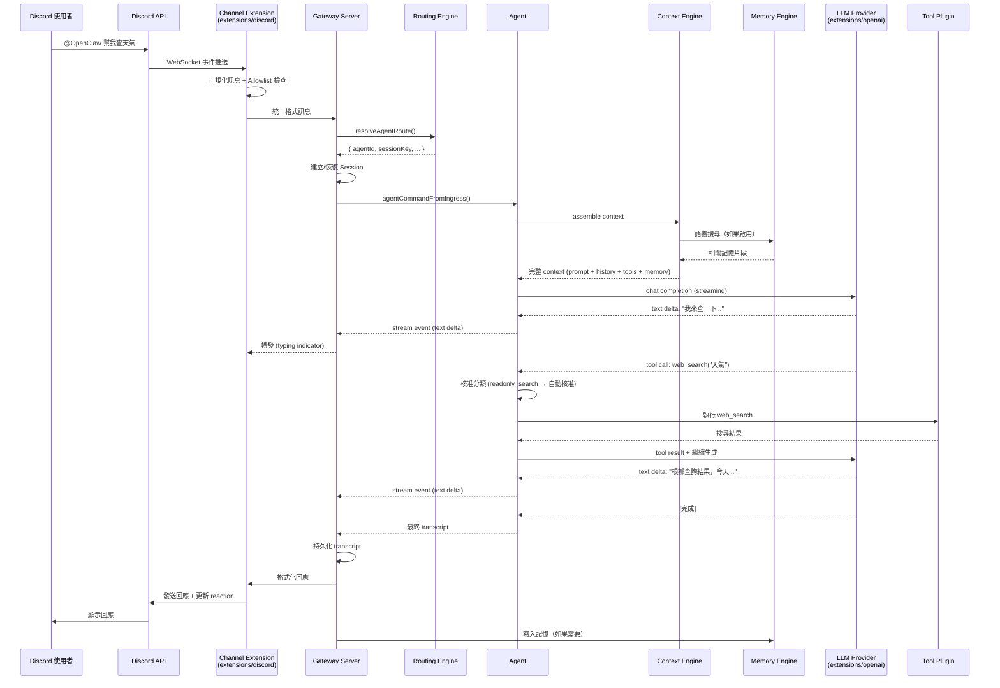

# 完整請求回應流程 — 資料在系統中的流動

> **摘要**：本章以一則 Discord 訊息為例，追蹤它從進入 OpenClaw 到回應送出的完整路徑。整個流程經歷八個主要階段：外部平台接收 → Channel adapter 正規化 → Gateway 路由 → Agent 載入 context → 呼叫 LLM → 處理 tool calls → 回應格式化 → 發送回平台。在這個過程中，Hook 會在關鍵點觸發，串流回應會即時推送，錯誤會被捕獲和處理，記憶會在適當時機讀取和寫入。

---

## 1. 端到端資料流總覽

```
┌────────────────────────────────────────────────────────────────────┐
│                      完整請求回應流程                                │
│                                                                     │
│  ① Discord 平台收到使用者訊息                                        │
│       ↓                                                             │
│  ② Channel Adapter (extensions/discord) 接收並正規化                 │
│       ↓                                                             │
│  ③ Gateway 路由到正確的 Session / Agent                              │
│       ↓                                                             │
│  ④ Agent 載入 Context (config, memory, tools, skills)               │
│       ↓                                                             │
│  ⑤ 呼叫 LLM (透過 Provider Extension)                              │
│       ↓                                                             │
│  ⑥ 處理 Tool Calls (包含 Approval Flow)                            │
│       ↓                                                             │
│  ⑦ 回應格式化 (channel-specific)                                    │
│       ↓                                                             │
│  ⑧ 發送回 Discord 平台                                              │
│                                                                     │
│  ↕ Hook 在各階段觸發                                                │
│  ↕ 串流回應即時推送                                                  │
│  ↕ 記憶在 ④ 讀取、在 ⑧ 後寫入                                      │
└────────────────────────────────────────────────────────────────────┘
```

讓我們逐一深入每個階段。

---

## 2. 階段 ①：外部平台收到訊息

流程的起點在 OpenClaw 之外。一個使用者在 Discord 伺服器中輸入了一則訊息，例如 `@OpenClaw 幫我查一下天氣`。

Discord 的伺服器透過 WebSocket 將這則訊息推送到 OpenClaw 的 Discord bot client。這個 bot client 是由 `extensions/discord` Extension 管理的，它維持著與 Discord API 的長連接。

```json
// extensions/discord/package.json:34-48
// Discord Extension 的 channel 定義
{
  "openclaw": {
    "channel": {
      "id": "discord",
      "label": "Discord",
      "selectionLabel": "Discord (Bot API)",
      "detailLabel": "Discord Bot",
      "markdownCapable": true
    }
  }
}
```

> — `source-repo/extensions/discord/package.json:34-48`

---

## 3. 階段 ②：Channel Adapter 接收並正規化

### 3.1 訊息正規化

Discord Extension 收到原始的 Discord 事件後，需要將其轉換為 OpenClaw 的統一訊息格式。這個過程包括：

1. **提取發送者資訊**：使用者 ID、暱稱、角色
2. **識別對話類型**：DM（私訊）、群聊、討論串
3. **提取訊息內容**：文字、附件、引用
4. **判斷是否為 bot mention**：是否 @ 了 bot

Channel 層有完整的訊息類型系統：

```typescript
// source-repo/src/sessions/session-chat-type.ts
// 對話類型衍生：DM、group、thread 等
```

> — `source-repo/src/sessions/session-chat-type.ts`

### 3.2 允許清單過濾

在正規化之後（但在路由之前），Channel 層會檢查允許清單（allowlist）：

```typescript
// source-repo/src/channels/allowlist-match.ts
// 發送者允許清單執行

// source-repo/src/channels/allow-from.ts
// 允許/拒絕策略
```

> — `source-repo/src/channels/allowlist-match.ts` / `source-repo/src/channels/allow-from.ts`

如果發送者不在允許清單中，訊息會被丟棄，不會進入路由。

### 3.3 來源追蹤

每則訊息會被標記其來源，用於後續的審計和行為決策：

```typescript
// source-repo/src/sessions/input-provenance.ts
// 追蹤訊息來源（哪個 Channel、哪個帳號、哪個使用者）
```

> — `source-repo/src/sessions/input-provenance.ts`

---

## 4. 階段 ③：Gateway 路由到正確的 Session / Agent

### 4.1 路由解析

正規化的訊息進入 Gateway 的路由引擎。路由引擎根據 binding 配置決定目標 Agent 和 Session：

```typescript
// source-repo/src/routing/resolve-route.ts:632
resolveAgentRoute(input: ResolveAgentRouteInput): ResolvedAgentRoute
```

> — `source-repo/src/routing/resolve-route.ts:632`

路由輸入包含：

```typescript
// source-repo/src/routing/resolve-route.ts:27-38
{
  cfg: OpenClawConfig,       // 配置
  channel: "discord",         // Channel 類型
  accountId: "bot-account-1", // 使用哪個 bot 帳號
  peer: { kind: "dm", id: "user-12345" },  // 對方（如果是 DM）
  guildId: "guild-67890",    // Discord guild ID
  memberRoleIds: ["role-A"]  // 發送者的角色
}
```

> — `source-repo/src/routing/resolve-route.ts:27-38`

路由引擎會按優先順序評估 binding（peer → guild+roles → guild → account → channel → default），並回傳：

```typescript
// source-repo/src/routing/resolve-route.ts:40-61
{
  agentId: "assistant",
  channel: "discord",
  accountId: "bot-account-1",
  sessionKey: "agent:assistant:discord:bot-account-1:dm:user-12345",
  mainSessionKey: "agent:assistant:discord:bot-account-1:main",
  matchedBy: "binding.guild"
}
```

> — `source-repo/src/routing/resolve-route.ts:40-61`

### 4.2 Session 建立或恢復

根據 `sessionKey`，Gateway 會嘗試找到已存在的 Session，或建立新的：

```typescript
// source-repo/src/sessions/session-lifecycle-events.ts:1-28
// 建立新 Session 時發射 lifecycle event
emitSessionLifecycleEvent({
  sessionKey: "agent:assistant:discord:...",
  reason: "new-message",
  label: "Discord DM with Alice"
})
```

> — `source-repo/src/sessions/session-lifecycle-events.ts:1-28`

### 4.3 Chat Send 處理

訊息被送入 Gateway 的 chat send 處理流程：

```typescript
// source-repo/src/gateway/server-methods/chat.ts:1-120
// 主要的 chat send method：
// 1. parseMessageWithAttachments()  — 解析訊息與附件
// 2. validateChatSendParams()       — 驗證參數
// 3. 正規化附件參考
// 4. 觸發 agent command
// 5. 發射 transcript 更新
```

> — `source-repo/src/gateway/server-methods/chat.ts:1-120`

Gateway 使用一個佇列式的 chat run registry 來管理並行的對話：

```typescript
// source-repo/src/gateway/server-chat.ts:132-195
createChatRunRegistry() {
  add()    // 將 chat run 加入佇列
  peek()   // 查看佇列頭部（不移除）
  shift()  // FIFO 出列
  remove() // 依 clientRunId 移除
  clear()  // 清空所有
}
```

> — `source-repo/src/gateway/server-chat.ts:132-195`

---

## 5. 階段 ④：Agent 載入 Context

### 5.1 Agent 命令執行

路由完成後，Gateway 將控制權交給 Agent。Agent 的入口是 `agent-command.ts`：

```typescript
// source-repo/src/agents/agent-command.ts:1-100
// Agent 命令執行入口
// 處理：模型選擇、fallback、skills 載入、session 持久化
// 導入：resolveDefaultModelForAgent, normalizeModelRef, buildWorkspaceSkillSnapshot
```

> — `source-repo/src/agents/agent-command.ts:1-100`

### 5.2 Context 組裝

Context Engine 負責將所有相關資訊組裝成 LLM 可以理解的 prompt：

```typescript
// source-repo/src/context-engine/index.ts:1-27
// Context Engine API：
registerContextEngine()          // 註冊引擎
resolveContextEngine()           // 解析指定引擎
delegateCompactionToRuntime()    // 委託壓縮

// Context Engine 類型：
// source-repo/src/context-engine/types.ts
ContextEngine {
  assemble() → AssembleResult    // 組裝完整 context
  compact() → CompactResult      // 壓縮長對話
}
```

> — `source-repo/src/context-engine/index.ts:1-27` / `source-repo/src/context-engine/types.ts`

Context 組裝包含以下資訊源：

1. **系統提示詞**（System Prompt）：來自 Agent 的 identity 配置
2. **對話歷史**（Transcript）：這個 Session 之前的對話記錄
3. **活動技能**（Active Skills）：根據 Agent 配置載入的 SKILL.md 內容
4. **工具定義**（Tool Definitions）：Agent 可用的工具清單及 schema
5. **記憶搜尋結果**（Memory）：從記憶系統檢索的相關資訊

### 5.3 記憶讀取

如果 Agent 配置了 `memorySearch`，記憶引擎會在此階段被查詢：

```typescript
// source-repo/src/memory-host-sdk/engine.ts:1-7
// 記憶引擎的四個層面：
// - engine-foundation.ts   核心引擎介面
// - engine-storage.ts      儲存後端
// - engine-embeddings.ts   嵌入生成/搜尋（語義搜尋）
// - engine-qmd.ts          QMD 處理

// source-repo/src/memory-host-sdk/query.ts
// 記憶搜尋/查詢介面
```

> — `source-repo/src/memory-host-sdk/engine.ts:1-7`

記憶讀取發生在 LLM 呼叫**之前**，搜尋結果會被注入到 context 中，讓 LLM 能夠參考過去的資訊。

### 5.4 模型選擇

Agent 支援模型 fallback 鏈：

```typescript
// source-repo/src/agents/agent-command.ts
// resolveDefaultModelForAgent — 解析 Agent 的預設模型
// resolveEffectiveModelFallbacks() — 解析有效的 fallback 鏈
// normalizeModelRef — 正規化模型參考（如 "openai:gpt-4o"）
```

> — `source-repo/src/agents/agent-command.ts`

也支援 per-session 的模型覆寫：

```typescript
// source-repo/src/sessions/model-overrides.ts
// 每個 Session 可以覆寫模型選擇
```

> — `source-repo/src/sessions/model-overrides.ts`

---

## 6. 階段 ⑤：呼叫 LLM

### 6.1 Provider 路由

組裝好 context 後，Agent 透過 Provider Extension 呼叫 LLM。模型參考的格式是 `provider:model`（如 `openai:gpt-4o`），Provider 前綴決定了使用哪個 Extension。

每個 Provider Extension 封裝了特定 LLM 服務的 API 呼叫邏輯：

```
extensions/openai/      — OpenAI API (GPT 系列)
extensions/anthropic/   — Anthropic API (Claude 系列)
extensions/google/      — Google AI (Gemini 系列)
extensions/groq/        — Groq (快速推論)
extensions/ollama/      — Ollama (本地模型)
... 40+ 個 provider extension
```

### 6.2 推論請求

Provider Extension 將 OpenClaw 的統一格式轉換為各 LLM API 的特定格式，發送推論請求。請求通常包含：

- System prompt（系統提示詞）
- Message history（對話歷史）
- Tool definitions（工具定義 schema）
- Model parameters（溫度、最大 token 數等）

### 6.3 串流回應

大多數 LLM 都支援串流回應（streaming）。OpenClaw 的串流架構基於 SSE（Server-Sent Events）和 WebSocket：

```typescript
// source-repo/src/gateway/openai-http.ts:111-113
// SSE 串流寫入
function writeSse(res, data) {
  // 寫入 JSON chunk 為 "data: {json}\n\n" 格式
}
```

> — `source-repo/src/gateway/openai-http.ts:111-113`

串流的生命週期：

```
LLM API → Provider Extension → Agent → Gateway → Client
                                          ↓
                               SSE / WebSocket frames
                                          ↓
                              即時推送到 CLI/WebChat/App
```

Gateway 透過事件系統串流更新：

```typescript
// source-repo/src/gateway/server-methods/chat.ts:23
emitSessionTranscriptUpdate()
// 在 chat 執行期間發射 transcript 事件
```

> — `source-repo/src/gateway/server-methods/chat.ts:23`

Agent 事件以結構化格式傳輸：

```typescript
// source-repo/src/gateway/protocol/schema/agent.ts:31
AgentEventSchema {
  stream: NonEmptyString  // 事件歸類用的 stream 欄位
}
```

> — `source-repo/src/gateway/protocol/schema/agent.ts:31`

串流的中斷（abort）由 Gateway 管理：

```typescript
// source-repo/src/gateway/chat-abort.ts
// Chat 中斷/打斷處理
```

> — `source-repo/src/gateway/chat-abort.ts`

---

## 7. 階段 ⑥：處理 Tool Calls（包含 Approval Flow）

### 7.1 Tool Call 識別

LLM 的回應中可能包含 tool call（工具呼叫）。例如，模型可能決定呼叫 `web_search` 工具來查詢天氣。

```typescript
// source-repo/src/chat/tool-content.ts
// Tool call 內容渲染
```

> — `source-repo/src/chat/tool-content.ts`

### 7.2 核准分類（Approval Classification）

在執行 tool call 之前，系統會對其進行安全分類：

```typescript
// source-repo/src/acp/approval-classifier.ts:24-32
AcpApprovalClass =
  | "readonly_scoped"     // 安全的只讀範圍查詢（自動核准）
  | "readonly_search"     // 一般搜尋（自動核准）
  | "mutating"            // 資料修改操作（需要核准）
  | "exec_capable"        // 命令執行工具（需要核准）
  | "control_plane"       // Session/子代理產生（需要核准）
  | "interactive"         // 互動式工具
  | "other"               // 其他
  | "unknown"             // 未知
```

> — `source-repo/src/acp/approval-classifier.ts:24-32`

```typescript
// source-repo/src/acp/approval-classifier.ts
resolveToolNameForPermission()  // 提取工具名稱用於權限決策
```

> — `source-repo/src/acp/approval-classifier.ts`

### 7.3 執行安全模式

系統的執行安全策略有三個層級：

```typescript
// source-repo/src/infra/exec-approvals.ts:20-57
ExecSecurity = "deny" | "allowlist" | "full"
ExecAsk = "off" | "on-miss" | "always"
ExecHost = "sandbox" | "gateway" | "node"
```

> — `source-repo/src/infra/exec-approvals.ts:20-57`

| 安全模式 | 行為 |
|---------|------|
| `deny` | 拒絕所有執行 |
| `allowlist` | 只允許白名單中的命令 |
| `full` | 允許所有執行 |

| 詢問模式 | 行為 |
|---------|------|
| `off` | 不詢問，自動決定 |
| `on-miss` | 不在白名單中時詢問 |
| `always` | 每次都詢問 |

| 執行主機 | 行為 |
|---------|------|
| `sandbox` | 在沙箱環境中執行 |
| `gateway` | 在 Gateway 主機上執行 |
| `node` | 在遠端節點（行動裝置等）上執行 |

### 7.4 核准流程

```
Tool Call 識別
     ↓
安全分類 (AcpApprovalClass)
     ↓
    ┌─── readonly_scoped/readonly_search ──→ 自動核准 → 執行
    │
    ├─── mutating/exec_capable/control_plane
    │         ↓
    │    檢查 ExecSecurity 策略
    │         ↓
    │    ┌── deny ──→ 拒絕
    │    ├── allowlist + 在白名單中 ──→ 自動核准
    │    ├── allowlist + 不在白名單中 ──→ 根據 ExecAsk 決定
    │    └── full ──→ 根據 ExecAsk 決定
    │                    ↓
    │              ┌── off ──→ 自動核准
    │              ├── on-miss ──→ 不在白名單時發送核准請求
    │              └── always ──→ 每次發送核准請求
    │                               ↓
    │                    使用者在 Channel 或控制 UI 核准/拒絕
    │                               ↓
    └──────────────────────→ 執行 Tool Call
                                    ↓
                              回傳結果給 LLM
```

核准的類型區分：

```typescript
// source-repo/src/infra/approval-types.ts:1
ChannelApprovalKind = "exec" | "plugin"
```

> — `source-repo/src/infra/approval-types.ts:1`

### 7.5 Tool Call 迴圈

LLM 可能會進行多輪 tool call。每次 tool call 的結果會被加入對話歷史，然後再次呼叫 LLM。這個迴圈持續到 LLM 生成最終的文字回應為止。

```
LLM 回應包含 tool call
     ↓
核准 + 執行 tool
     ↓
將 tool 結果加入對話歷史
     ↓
再次呼叫 LLM
     ↓
LLM 回應（可能包含更多 tool calls，或最終文字回應）
     ↓
重複直到最終回應
```

---

## 8. 階段 ⑦：回應格式化

### 8.1 Channel-specific 格式化

Agent 生成的回應需要被格式化為目標 Channel 的特定格式。不同平台有不同的能力和限制：

| 平台 | Markdown 支援 | 訊息長度限制 | 特殊功能 |
|------|-------------|-----------|---------|
| Discord | ✅ 部分支援 | 2000 字元 | Embed、Reaction、Thread |
| Telegram | ✅ 部分支援 | 4096 字元 | Inline keyboard |
| WhatsApp | ❌ 純文字 | 65536 字元 | Media message |
| Slack | ✅ mrkdwn | ~40000 字元 | Block Kit |
| CLI/WebChat | ✅ 完整 Markdown | 無限制 | Canvas、A2UI |

Channel Extension 負責將統一格式的回應轉換為平台格式。

### 8.2 訊息分割

如果回應超過平台的長度限制，需要進行分割。發送策略由 session 的 send policy 控制：

```typescript
// source-repo/src/sessions/send-policy.ts
// 訊息發送策略
```

> — `source-repo/src/sessions/send-policy.ts`

### 8.3 Canvas 渲染

對於支援的平台（主要是 WebChat），Agent 可以透過 Canvas 渲染富媒體內容：

```typescript
// source-repo/src/chat/canvas-render.ts
// 從 chat 訊息中提取 Canvas 內容
```

> — `source-repo/src/chat/canvas-render.ts`

---

## 9. 階段 ⑧：發送回外部平台

### 9.1 回應發送

格式化完成後，Channel Extension 透過平台 API 發送回應。在這個過程中：

1. **停止 typing indicator**
2. **更新 status reaction**（如將 ⏳ 改為 ✅）
3. **發送訊息內容**
4. **處理媒體附件**（如果有的話）

```typescript
// source-repo/src/channels/typing.ts
// Typing indicator 狀態機

// source-repo/src/channels/status-reactions.ts
// 狀態 emoji/reaction 更新

// source-repo/src/channels/ack-reactions.ts
// 確認處理
```

> — `source-repo/src/channels/typing.ts` / `source-repo/src/channels/status-reactions.ts` / `source-repo/src/channels/ack-reactions.ts`

### 9.2 Transcript 持久化

回應發送完成後，完整的對話 transcript 會被持久化到磁碟：

```
Gateway 的 session 持久化：
source-repo/src/gateway/session-*.ts
```

> — `source-repo/src/gateway/` 目錄

### 9.3 記憶寫入

對話完成後，如果啟用了記憶系統，重要的資訊會被寫入記憶儲存：

```
記憶引擎寫入時機：
- 對話完成後
- Agent 明確呼叫記憶工具時
- 系統偵測到值得記住的資訊時
```

記憶的寫入時機是在回應完成**之後**，這確保了只有成功的對話才會被記住。

---

## 10. Hook 在各階段的觸發

### 10.1 Hook 系統概述

OpenClaw 的 Hook 系統允許在對話流程的各個關鍵點執行自定義邏輯。Hook 可以來自四個來源：

```typescript
// source-repo/src/hooks/types.ts:1-68
Hook {
  name: string
  description?: string
  source: "openclaw-bundled" | "openclaw-managed" | "openclaw-workspace" | "openclaw-plugin"
  filePath: string
  baseDir: string
  handlerPath: string
}
```

> — `source-repo/src/hooks/types.ts:1-68`

### 10.2 Hook 載入

Hook 在 Gateway 啟動時透過 `loadInternalHooks()` 載入：

```typescript
// source-repo/src/hooks/loader.ts:1-100
loadInternalHooks(cfg, workspaceDir, opts?)
// 從目錄和 legacy config 載入 hooks
// 讀取 HOOK.md frontmatter 和元資料
// 透過 registerInternalHook() 註冊處理器
// 預設啟用，除非 cfg.hooks?.internal?.enabled === false
```

> — `source-repo/src/hooks/loader.ts:1-100`

Hook 處理器存儲在全域單例中：

```typescript
// source-repo/src/hooks/loader.ts
// 全域單例：LOADED_INTERNAL_HOOK_REGISTRATIONS_KEY
```

> — `source-repo/src/hooks/loader.ts`

### 10.3 Gateway 層的 Hook 配置

Gateway 中的 Hook 有精細的配置：

```typescript
// source-repo/src/gateway/hooks.ts:22-101
HooksConfigResolved {
  basePath           // Hook 基礎路徑（預設 "/hooks"）
  token              // Hook 認證 token
  maxBodyBytes       // 最大 body 大小（預設 256KB）
  mappings           // Hook 映射
  policies {
    agent {
      defaultAgentId      // 預設 Agent ID
      knownAgentIds       // 已知 Agent ID 集合
      allowedAgentIds     // 允許的 Agent ID 集合
    }
    session {
      defaultSessionKey        // 預設 Session Key
      allowRequestSessionKey   // 是否允許請求指定 Session Key
      prefixes                 // 允許的 Session Key 前綴
    }
  }
}
```

> — `source-repo/src/gateway/hooks.ts:22-101`

### 10.4 Hook 認證

外部 Webhook 呼叫需要 token 認證：

```typescript
// source-repo/src/gateway/hooks.ts:141-154
extractHookToken()
// 從 Authorization header 或 x-openclaw-token header 提取 token
```

> — `source-repo/src/gateway/hooks.ts:141-154`

### 10.5 Hook 安全限制

```typescript
// source-repo/src/gateway/hooks.ts:156-174
readJsonBody()
// 解析請求 body，有大小限制（預設 256KB）
```

> — `source-repo/src/gateway/hooks.ts:156-174`

### 10.6 Hook 輔助功能

```typescript
// source-repo/src/gateway/hooks.ts:230-268
resolveHookChannel()          // 從 payload 驗證 channel
resolveHookIdempotencyKey()   // 從 header 或 payload 提取冪等 key
```

> — `source-repo/src/gateway/hooks.ts:230-268`

### 10.7 Hook 觸發時序

```
┌─────────────────────────────────────────────────┐
│              Hook 觸發時序圖                      │
│                                                  │
│  訊息到達                                         │
│    ↓                                             │
│  [Hook: session:start] — 新 Session 建立時        │
│    ↓                                             │
│  Channel 正規化                                   │
│    ↓                                             │
│  路由解析                                         │
│    ↓                                             │
│  [Hook: command:new] — 新命令開始時                │
│    ↓                                             │
│  Agent 載入 context                               │
│    ↓                                             │
│  LLM 呼叫                                        │
│    ↓                                             │
│  Tool call 處理                                   │
│    ↓                                             │
│  回應生成                                         │
│    ↓                                             │
│  回應發送                                         │
│    ↓                                             │
│  Transcript 持久化                                │
│    ↓                                             │
│  記憶寫入                                         │
└─────────────────────────────────────────────────┘
```

---

## 11. 串流回應的資料流

### 11.1 串流架構

OpenClaw 支援兩種串流方式：

1. **SSE（Server-Sent Events）**：透過 HTTP 的單向串流，相容 OpenAI API 格式
2. **WebSocket**：雙向即時通訊，用於 CLI、WebChat、App

```typescript
// source-repo/src/gateway/openai-http.ts:111-113
function writeSse(res, data) {
  // 寫入格式："data: {json}\n\n"
}
```

> — `source-repo/src/gateway/openai-http.ts:111-113`

### 11.2 串流事件類型

串流中的事件包括：

- **text delta**：助理文字的增量更新
- **tool call delta**：tool call 參數的增量更新
- **thinking delta**：推理過程的增量更新
- **tool result**：tool 執行結果
- **transcript update**：整體 transcript 的快照更新

### 11.3 串流生命週期

```
Agent 開始生成
     ↓
[SSE: data: {"type": "text_delta", "text": "我"}]
[SSE: data: {"type": "text_delta", "text": "來查"}]
[SSE: data: {"type": "text_delta", "text": "一下"}]
     ↓
[SSE: data: {"type": "tool_call", "name": "web_search", ...}]
     ↓
（等待核准 + 執行）
     ↓
[SSE: data: {"type": "tool_result", "result": "..."}]
     ↓
[SSE: data: {"type": "text_delta", "text": "根據查詢結果..."}]
     ↓
[SSE: data: [DONE]]
     ↓
最終 transcript 快照持久化
```

---

## 12. 錯誤處理流程

### 12.1 錯誤層級

OpenClaw 在每個層級都有錯誤處理：

1. **Channel 層錯誤**：平台 API 失敗（如 Discord rate limit）
   - Channel Manager 的指數退避重啟策略處理

2. **路由層錯誤**：找不到匹配的 Agent
   - 使用預設 Agent（`default: true`）

3. **LLM 層錯誤**：Provider API 失敗
   - Model fallback 鏈自動切換到備用模型

4. **Tool 層錯誤**：工具執行失敗
   - 錯誤結果返回給 LLM，讓模型決定如何處理

5. **Gateway 層錯誤**：WebSocket 斷線、Session 損壞
   - 生命週期事件通知 + 自動恢復

### 12.2 錯誤隔離

Session 生命週期事件的發射使用錯誤隔離：

```typescript
// source-repo/src/sessions/session-lifecycle-events.ts:20-28
emitSessionLifecycleEvent(event)
// 發射給所有監聽器，每個監聯器的錯誤被單獨捕獲
// 一個監聽器的錯誤不會影響其他監聽器
```

> — `source-repo/src/sessions/session-lifecycle-events.ts:20-28`

### 12.3 入口錯誤處理

在最外層，entry.ts 有全域錯誤處理：

```typescript
// source-repo/src/entry.ts:200-213
// Async error wrapping for module imports
// Detailed error logging with stack traces
```

> — `source-repo/src/entry.ts:200-213`

---

## 13. 記憶的讀取與寫入時機

### 13.1 讀取時機

記憶在 **Agent 載入 context（階段 ④）** 時被讀取。流程是：

1. Agent 準備組裝 context
2. 如果 `memorySearch` 已啟用，查詢記憶引擎
3. 記憶引擎透過 embeddings 進行語義搜尋
4. 相關的記憶片段被注入到 system prompt 或 context 中
5. LLM 可以在回答時參考這些記憶

### 13.2 寫入時機

記憶在 **對話完成（階段 ⑧ 之後）** 時寫入。有兩種寫入途徑：

1. **自動寫入**：系統偵測到對話中的重要資訊，自動寫入記憶
2. **工具呼叫寫入**：Agent 透過 memory tool 明確寫入資訊

### 13.3 記憶引擎架構

```typescript
// source-repo/src/memory-host-sdk/engine.ts:1-7
// 四個引擎面向：
engine-foundation.ts   // 核心介面
engine-storage.ts      // 儲存後端（如 LanceDB）
engine-embeddings.ts   // 嵌入生成與語義搜尋
engine-qmd.ts          // QMD 處理
```

> — `source-repo/src/memory-host-sdk/engine.ts:1-7`

---

## 14. 完整流程的 Mermaid 序列圖



---

## 引用來源

| 來源檔案 | 行號範圍 | 引用內容 |
|---------|---------|---------|
| `source-repo/extensions/discord/package.json` | 34-48 | Discord channel 定義 |
| `source-repo/src/routing/resolve-route.ts` | 27-61, 632 | 路由輸入/輸出型別、主匯出 |
| `source-repo/src/sessions/session-lifecycle-events.ts` | 1-28 | Session 生命週期事件 |
| `source-repo/src/gateway/server-methods/chat.ts` | 1-120 | Chat send method |
| `source-repo/src/gateway/server-chat.ts` | 132-195 | Chat run registry |
| `source-repo/src/agents/agent-command.ts` | 1-100 | Agent 命令執行入口 |
| `source-repo/src/context-engine/index.ts` | 1-27 | Context engine API |
| `source-repo/src/context-engine/types.ts` | — | Context engine 型別 |
| `source-repo/src/memory-host-sdk/engine.ts` | 1-7 | 記憶引擎結構 |
| `source-repo/src/memory-host-sdk/query.ts` | — | 記憶查詢介面 |
| `source-repo/src/sessions/model-overrides.ts` | — | Per-session 模型覆寫 |
| `source-repo/src/gateway/openai-http.ts` | 111-113 | SSE 串流 |
| `source-repo/src/gateway/protocol/schema/agent.ts` | 31 | Agent 事件 schema |
| `source-repo/src/gateway/chat-abort.ts` | — | Chat 中斷 |
| `source-repo/src/acp/approval-classifier.ts` | 24-32 | 核准分類 |
| `source-repo/src/infra/exec-approvals.ts` | 20-57 | 執行安全模式 |
| `source-repo/src/infra/approval-types.ts` | 1 | 核准種類 |
| `source-repo/src/hooks/types.ts` | 1-68 | Hook 型別定義 |
| `source-repo/src/hooks/loader.ts` | 1-100 | Hook 載入 |
| `source-repo/src/gateway/hooks.ts` | 22-268 | Gateway hook 配置 |
| `source-repo/src/channels/` | 目錄 | Channel 狀態管理 |
| `source-repo/src/sessions/send-policy.ts` | — | 發送策略 |
| `source-repo/src/chat/tool-content.ts` | — | Tool call 渲染 |
| `source-repo/src/chat/canvas-render.ts` | — | Canvas 渲染 |
| `source-repo/src/entry.ts` | 200-213 | 全域錯誤處理 |
