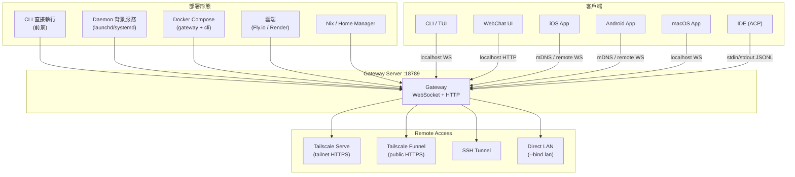

# 部署拓撲與遠端存取

> **摘要**：OpenClaw 支援多種部署形態——從最簡單的本地 CLI 直接執行，到 daemon 背景服務、Docker 容器、雲端平台（Fly.io、Render）、甚至 Nix 宣告式管理。Gateway 預設綁定到 loopback（127.0.0.1），但可以透過 Tailscale serve/funnel、SSH tunnel、或直接 LAN 綁定對外暴露。行動 App（iOS/Android）和 IDE（ACP 模式）作為 Gateway 的客戶端連接，形成一個以 Gateway 為中心的星狀拓撲。

---

## 1. 部署模式總覽

```
┌──────────────────────────────────────────────────────────────────┐
│                     OpenClaw 部署拓撲                              │
│                                                                   │
│  ┌────────────┐  ┌────────────┐  ┌────────────┐  ┌───────────┐  │
│  │ 本地 CLI   │  │ Daemon 模式│  │  Docker    │  │ 雲端部署  │  │
│  │            │  │            │  │            │  │           │  │
│  │ openclaw   │  │ launchd    │  │ docker-    │  │ Fly.io    │  │
│  │ (前景執行)  │  │ systemd    │  │ compose    │  │ Render    │  │
│  │            │  │ schtasks   │  │            │  │           │  │
│  └────────────┘  └────────────┘  └────────────┘  └───────────┘  │
│                                                                   │
│  ┌────────────┐  ┌────────────┐  ┌───────────────────────────┐  │
│  │  Nix 管理  │  │ 行動 App   │  │  IDE 整合 (ACP 模式)      │  │
│  │            │  │            │  │                            │  │
│  │ Home       │  │ iOS /      │  │  VSCode / Copilot CLI     │  │
│  │ Manager    │  │ Android    │  │                            │  │
│  └────────────┘  └────────────┘  └───────────────────────────┘  │
└──────────────────────────────────────────────────────────────────┘
```

---

## 2. 本地開發模式：直接 CLI

最簡單的使用方式是直接在終端執行 OpenClaw CLI：

```bash
openclaw           # 啟動互動式對話
openclaw gateway   # 啟動 Gateway 伺服器
```

### 2.1 進入點

系統的進入點是 `openclaw.mjs`，它引導到 `src/entry.ts`：

```typescript
// source-repo/src/entry.ts:37-157（簡化）
// 主要進入流程：
// 1. 安裝相容性層 (gaxios-fetch-compat)
// 2. 設定 process title 為 "openclaw"
// 3. 正規化環境、啟用 compile cache
// 4. 處理 --no-color 旗標
// 5. 支援 CLI respawn（profile/container 切換）
// 6. 快速路徑：--version、--help
// 7. 委派到 ./cli/run-main.js → runCli(argv)
```

> — `source-repo/src/entry.ts:37-157`

```typescript
// source-repo/package.json:16-17
// CLI 進入點
{ "bin": { "openclaw": "openclaw.mjs" } }
```

> — `source-repo/package.json:16-17`

### 2.2 Gateway 命令

啟動 Gateway 時，系統會：

1. 載入配置（`~/.openclaw/openclaw.json`）
2. 初始化所有子系統（auth、channels、plugins、hooks 等）
3. 綁定到指定的網路介面
4. 開始接受連接

### 2.3 推薦的安裝方式

README 推薦的安裝流程：

```bash
openclaw onboard --install-daemon
```

> — `source-repo/README.md:100-105`

這會同時完成初始設定和 daemon 安裝。

---

## 3. Daemon 模式：背景 Gateway 服務

### 3.1 Daemon 服務抽象

OpenClaw 提供了一個跨平台的 daemon 服務抽象：

```typescript
// source-repo/src/daemon/service.ts:66-78
GatewayService {
  stage()        // 準備服務配置
  install()      // 安裝為系統服務
  uninstall()    // 移除系統服務
  stop()         // 停止服務
  restart()      // 重啟服務
  isLoaded()     // 是否已載入
  readCommand()  // 讀取啟動命令
  readRuntime()  // 讀取執行時環境
}
```

> — `source-repo/src/daemon/service.ts:66-78`

### 3.2 平台特定實作

系統根據作業系統自動選擇正確的 daemon 實作：

```typescript
// source-repo/src/daemon/service.ts:172-225
GATEWAY_SERVICE_REGISTRY = {
  "darwin": LaunchAgent,    // macOS launchd
  "linux":  SystemdService, // Linux systemd
  "win32":  SchTasks        // Windows Scheduled Tasks
}

resolveGatewayService()  // 工廠函式，選擇平台實作
```

> — `source-repo/src/daemon/service.ts:172-225`

#### macOS: launchd

```typescript
// source-repo/src/daemon/launchd.ts:36-100
// 檔案模式：
LAUNCH_AGENT_DIR_MODE = 0o755
LAUNCH_AGENT_PLIST_MODE = 0o644

// Plist 路徑：~/Library/LaunchAgents/{label}.plist
// Label 來源：OPENCLAW_LAUNCHD_LABEL 環境變數或 profile

// 日誌路徑：~/.openclaw/state/logs/
// Plist 內容：label, programArguments, workingDirectory, stdout/stderr, environment
```

> — `source-repo/src/daemon/launchd.ts:36-100`

#### Linux: systemd

```typescript
// source-repo/src/daemon/systemd.ts:43-100
// Unit 路徑：~/.config/systemd/user/{service-name}.service
// Service name 來源：OPENCLAW_SYSTEMD_UNIT 環境變數或 profile

// 支援 user linger（session 持久化，不需要 root）：
enableSystemdUserLinger()
readSystemdUserLingerStatus()

// Unit 檔案解析：ExecStart, WorkingDirectory, Environment, EnvironmentFile
```

> — `source-repo/src/daemon/systemd.ts:43-100`

#### Windows: Scheduled Tasks

```typescript
// source-repo/src/daemon/schtasks.ts
// 使用 Windows Scheduled Tasks (schtasks) 管理
```

> — `source-repo/src/daemon/schtasks.ts`

### 3.3 服務狀態管理

```typescript
// source-repo/src/daemon/service.ts:93-143
readGatewayServiceState()  // 讀取合併狀態（installed, loaded, running）
startGatewayService()       // 啟動或重啟服務，追蹤結果
```

> — `source-repo/src/daemon/service.ts:93-143`

### 3.4 CLI 控制命令

CLI 提供了完整的 daemon 管理命令：

```
source-repo/src/cli/daemon-cli/
// daemon 控制命令：install, start, stop, status
```

> — `source-repo/src/cli/daemon-cli/` 目錄

---

## 4. Docker 部署

### 4.1 docker-compose.yml 架構

Docker 部署使用兩個 service 的架構：

```yaml
# source-repo/docker-compose.yml:1-79（完整）

services:
  # Service 1: Gateway（核心服務）
  openclaw-gateway:
    image: ${OPENCLAW_IMAGE:-openclaw:local}
    ports:
      - "${OPENCLAW_GATEWAY_PORT:-18789}:18789"   # Gateway WebSocket/HTTP
      - "${OPENCLAW_BRIDGE_PORT:-18790}:18790"     # Bridge 端口
    volumes:
      - "${OPENCLAW_CONFIG_DIR:-~/.openclaw}:/home/node/.openclaw"      # 配置
      - "${OPENCLAW_WORKSPACE_DIR:-~/.openclaw/workspace}:/home/node/.openclaw/workspace"  # 工作空間
      - "/var/run/docker.sock:/var/run/docker.sock"   # 可選：沙箱隔離
    command: >
      node dist/index.js gateway
        --bind ${OPENCLAW_GATEWAY_BIND:-lan}
        --port 18789
    healthcheck:
      test: ["CMD", "node", "-e", "fetch('http://127.0.0.1:18789/healthz')"]
      interval: 30s
      timeout: 5s
      retries: 5
      start_period: 20s

  # Service 2: CLI（操作工具）
  openclaw-cli:
    network_mode: "service:openclaw-gateway"  # 共享 Gateway 的網路
    security_opt:
      - no-new-privileges:true
    cap_drop:
      - NET_RAW
      - NET_ADMIN
    entrypoint: node dist/index.js
    depends_on:
      - openclaw-gateway
```

> — `source-repo/docker-compose.yml:1-79`

### 4.2 Port Mapping

| Port | 用途 | 說明 |
|------|------|------|
| **18789** | Gateway 主端口 | WebSocket + HTTP，包含 chat、hooks、healthz |
| **18790** | Bridge 端口 | 用於跨服務橋接通訊 |

```yaml
# source-repo/docker-compose.yml
ports:
  - "${OPENCLAW_GATEWAY_PORT:-18789}:18789"
  - "${OPENCLAW_BRIDGE_PORT:-18790}:18790"
```

> — `source-repo/docker-compose.yml`

### 4.3 Volume Mounting

| 路徑（容器內） | 用途 | 說明 |
|-------------|------|------|
| `/home/node/.openclaw` | 配置目錄 | 包含 openclaw.json、secrets、OAuth |
| `/home/node/.openclaw/workspace` | 工作空間 | Agent 工作空間、Session 資料 |
| `/var/run/docker.sock` | Docker Socket | 可選，用於沙箱容器隔離 |

### 4.4 Health Check

Gateway 提供 `/healthz` 端點用於健康檢查：

```yaml
# source-repo/docker-compose.yml:39-50
healthcheck:
  test: ["CMD", "node", "-e", "fetch('http://127.0.0.1:18789/healthz')"]
  interval: 30s
  timeout: 5s
  retries: 5
  start_period: 20s
```

> — `source-repo/docker-compose.yml:39-50`

### 4.5 CLI Service 安全

CLI service 有額外的安全限制：

- `no-new-privileges`：防止權限提升
- `cap_drop: NET_RAW, NET_ADMIN`：丟棄不需要的網路能力
- `network_mode: "service:openclaw-gateway"`：與 Gateway 共享網路命名空間

### 4.6 Dockerfile 建構

Dockerfile 使用多階段建構：

```dockerfile
# source-repo/Dockerfile:1-276（結構）

# Stage 1: ext-deps — 安裝外部依賴
# Stage 2: build — 編譯 TypeScript
#   - 安裝 Bun（含 5 次重試）
#   - pnpm install --frozen-lockfile
#   - NODE_OPTIONS=--max-old-space-size=2048
#   - pnpm build:docker
#   - pnpm ui:build
#   - pnpm qa:lab:build

# Stage 3: runtime — 最終映像
FROM node:24-bookworm-slim
WORKDIR /app

# 系統套件：procps, hostname, curl, git, lsof, openssl
# 可選：OPENCLAW_INSTALL_BROWSER=1 (Chromium + Xvfb, ~300MB)
# 可選：OPENCLAW_INSTALL_DOCKER_CLI=1 (Docker CE CLI + compose, ~50MB)

# 非 root 使用者
USER node

# 健康檢查：GET /healthz (3min interval)
HEALTHCHECK --interval=3m --timeout=10s \
  CMD node -e "fetch('http://127.0.0.1:18789/healthz')"

# 預設命令
CMD ["node", "openclaw.mjs", "gateway", "--allow-unconfigured"]
```

> — `source-repo/Dockerfile:1-276`

關鍵建構參數：

| 參數 | 預設值 | 說明 |
|------|-------|------|
| `OPENCLAW_EXTENSIONS` | — | 空格分隔的 extension 目錄名，選擇性包含 |
| `OPENCLAW_VARIANT` | `default` | `default` 或 `slim` |
| `OPENCLAW_BUNDLED_PLUGIN_DIR` | `extensions` | Plugin 目錄名 |
| `OPENCLAW_INSTALL_BROWSER` | `0` | 安裝 Chromium + Xvfb |
| `OPENCLAW_INSTALL_DOCKER_CLI` | `0` | 安裝 Docker CLI |
| `OPENCLAW_DOCKER_APT_UPGRADE` | — | 是否執行 apt upgrade |

> — `source-repo/Dockerfile:1-41`

---

## 5. 雲端部署

### 5.1 Fly.io

```toml
# source-repo/fly.toml:1-35（完整）

app = "openclaw"
primary_region = "iad"

[build]
  dockerfile = "Dockerfile"

[env]
  NODE_ENV = "production"
  OPENCLAW_PREFER_PNPM = "1"
  OPENCLAW_STATE_DIR = "/data"
  NODE_OPTIONS = "--max-old-space-size=1536"

[processes]
  app = "node dist/index.js gateway --allow-unconfigured --port 3000 --bind lan"

[[services]]
  internal_port = 3000
  protocol = "tcp"
  force_https = true
  auto_stop = false        # 不自動停止（保持長連接）
  auto_start = true
  min_machines_running = 1

[[vm]]
  size = "shared-cpu-2x"
  memory = "2048mb"

[[mounts]]
  source = "openclaw_data"
  destination = "/data"
```

> — `source-repo/fly.toml:1-35`

**Fly.io 部署重點**：

- 內部 port 3000（不是預設的 18789），因為 Fly 反向代理
- `--bind lan`（0.0.0.0）讓 Fly 的反向代理可以存取
- 強制 HTTPS
- 不自動停止（WebSocket 需要持久連接）
- 2GB RAM、shared-cpu-2x
- 持久化 volume 掛載到 `/data`

### 5.2 Render

```yaml
# source-repo/render.yaml:1-20（完整）

services:
  - type: web
    name: openclaw
    runtime: docker
    plan: starter
    healthCheckPath: /health
    envVars:
      - key: OPENCLAW_GATEWAY_PORT
        value: "8080"
      - key: OPENCLAW_STATE_DIR
        value: /data/.openclaw
      - key: OPENCLAW_WORKSPACE_DIR
        value: /data/workspace
      - key: OPENCLAW_GATEWAY_TOKEN
        generateValue: true    # 自動生成認證 token

    disk:
      name: openclaw-data
      mountPath: /data
      sizeGB: 1
```

> — `source-repo/render.yaml:1-20`

**Render 部署重點**：

- 使用 Docker runtime
- Port 8080（Render 慣例）
- 健康檢查路徑 `/health`
- 自動生成 Gateway token
- 1GB 持久化磁碟

---

## 6. Nix 安裝方式

### 6.1 Nix Module

OpenClaw 提供了一個獨立的 Nix module：

```
外部模組：nix-openclaw (https://github.com/openclaw/nix-openclaw)
```

> — `source-repo/docs/install/nix.md:1-80`

### 6.2 提供的內容

```markdown
<!-- source-repo/docs/install/nix.md:18-23 -->
Nix 安裝包含：
- Gateway + macOS app + 工具（whisper, spotify, cameras）
- Launchd service（macOS 重啟後自動恢復）
- Plugin 系統與宣告式配置
- 即時回滾：home-manager switch --rollback
```

> — `source-repo/docs/install/nix.md:18-23`

### 6.3 Nix 模式

啟用 Nix 模式的方式：

```bash
# 環境變數
OPENCLAW_NIX_MODE=1

# macOS GUI
defaults write ai.openclaw.mac openclaw.nixMode -bool true
```

> — `source-repo/docs/install/nix.md:54-56`

### 6.4 Nix 模式的行為差異

```markdown
<!-- source-repo/docs/install/nix.md:70-77 -->
Nix 模式下的變化：
- 自動安裝流程停用（不能 runtime 安裝 extension）
- 缺失依賴顯示 Nix 特定的修復建議
- UI 顯示唯讀 Nix mode 橫幅
- 必須明確設定 OPENCLAW_CONFIG_PATH 和 OPENCLAW_STATE_DIR
- 運行時狀態/配置必須在不可變的 /nix/store 之外
```

> — `source-repo/docs/install/nix.md:70-77`

---

## 7. Remote Access：從外部存取 Gateway

### 7.1 網路綁定模式

Gateway 支援多種網路綁定模式：

```typescript
// source-repo/src/config/types.gateway.ts:3
GatewayBindMode = "auto" | "lan" | "loopback" | "custom" | "tailnet"
```

> — `source-repo/src/config/types.gateway.ts:3`

每種模式的行為：

```typescript
// source-repo/src/gateway/net.ts:298-352
// resolveGatewayBindHost() 的行為：

"loopback" → 127.0.0.1（嘗試綁定，極端 fallback 到 0.0.0.0）
"lan"      → 0.0.0.0（無 fallback，直接綁定所有介面）
"auto"     → 127.0.0.1 如果可用，否則 0.0.0.0
"tailnet"  → Tailnet IPv4（100.64.0.0/10 範圍），fallback 到 loopback
"custom"   → 使用者指定的地址，fallback 到 0.0.0.0
```

> — `source-repo/src/gateway/net.ts:298-352`

容器自動偵測：

```typescript
// source-repo/src/gateway/net.ts:342-349
// 偵測到 Docker/Podman/K8s namespace 時
// 自動切換到 0.0.0.0（因為容器需要 port-forwarding）
```

> — `source-repo/src/gateway/net.ts:342-349`

### 7.2 Tailscale 整合

Tailscale 是 OpenClaw 的首選遠端存取方案：

```typescript
// source-repo/src/config/types.gateway.ts:173-180
GatewayTailscaleMode = "off" | "serve" | "funnel"

GatewayTailscaleConfig {
  mode?: GatewayTailscaleMode
  resetOnExit?: boolean          // 結束時是否重置
}
```

> — `source-repo/src/config/types.gateway.ts:173-180`

三種 Tailscale 模式：

| 模式 | 行為 | 存取範圍 |
|------|------|---------|
| `off` | 不使用 Tailscale | — |
| `serve` | Tailscale Serve | 僅 Tailnet 內部（HTTPS） |
| `funnel` | Tailscale Funnel | 公開網際網路（HTTPS） |

```typescript
// source-repo/src/gateway/server-tailscale.ts:10-57
startGatewayTailscaleExposure(params) {
  // "serve": enableTailscaleServe(port) — tailnet-only HTTPS
  // "funnel": enableTailscaleFunnel(port) — 公開 internet
  // 取得 tailnet hostname，記錄 HTTPS URL + WS 端點
  // 可選：exit 時清除配置
}
```

> — `source-repo/src/gateway/server-tailscale.ts:10-57`

### 7.3 SSH Tunnel

OpenClaw 內建 SSH tunnel 支援：

```typescript
// source-repo/src/infra/ssh-tunnel.ts:1-80

SshParsedTarget {
  user?: string    // SSH 使用者
  host: string     // 主機位址
  port: number     // SSH port
}

SshTunnel {
  parsedTarget: SshParsedTarget
  localPort: number      // 本地端 port
  remotePort: number     // 遠端 port
  pid: number | null     // SSH process PID
  stderr: string[]       // 錯誤輸出
  stop: () => Promise<void>  // 停止 tunnel
}

parseSshTarget()    // 解析 "user@host:port" 格式
                     // 安全：拒絕以 "-" 開頭的 hostname（防止參數注入）
pickEphemeralPort() // 分配本地 ephemeral port
canConnectLocal()   // 檢查本地 port 是否在監聽
```

> — `source-repo/src/infra/ssh-tunnel.ts:1-80`

### 7.4 Remote Gateway 配置

配置遠端 Gateway 連接：

```typescript
// source-repo/src/config/types.gateway.ts:182-199
GatewayRemoteConfig {
  enabled?: boolean
  url?: string                // ws:// 或 wss:// URL
  transport?: "ssh" | "direct"  // SSH tunnel 或直接 WebSocket
  token?: SecretInput          // 認證 token
  password?: SecretInput       // 認證密碼
  tlsFingerprint?: string      // TLS 憑證指紋
  sshTarget?: string           // user@host 格式
  sshIdentity?: string         // SSH 私鑰路徑
}
```

> — `source-repo/src/config/types.gateway.ts:182-199`

Gateway 主配置中的相關欄位：

```typescript
// source-repo/src/config/types.gateway.ts:392-415
GatewayConfig {
  port?: number              // 預設 18789
  mode?: "local" | "remote"  // "remote" 時停用本地啟動
  bind?: GatewayBindMode     // 綁定模式
  customBindHost?: string    // custom 模式的指定地址
  tailscale?: GatewayTailscaleConfig
  remote?: GatewayRemoteConfig
}
```

> — `source-repo/src/config/types.gateway.ts:392-415`

### 7.5 遠端存取的典型拓撲

```
場景 1：Tailscale Serve（最推薦）
┌──────────┐     Tailnet     ┌──────────────┐
│ 行動 App │ ────HTTPS────→ │ Gateway      │
│ (外出)   │                 │ (家中/VPS)   │
└──────────┘                 └──────────────┘

場景 2：SSH Tunnel
┌──────────┐    SSH    ┌──────────────┐
│ CLI      │ ──tunnel→ │ Gateway      │
│ (遠端)   │    :18789 │ (家中)       │
└──────────┘           └──────────────┘

場景 3：Tailscale Funnel（公開存取）
┌──────────┐   Internet   ┌─────────────┐    ┌──────────────┐
│ 任何客戶端│ ──HTTPS───→ │ Tailscale   │ →  │ Gateway      │
└──────────┘              │ CDN         │    │ (家中)       │
                          └─────────────┘    └──────────────┘
```

---

## 8. 行動 App 如何連接 Gateway

### 8.1 共享框架 OpenClawKit

iOS 和 macOS App 共享一個 `OpenClawKit` 框架：

```
source-repo/apps/shared/OpenClawKit/Sources/OpenClawKit/
├── GatewayChannel.swift              # WebSocket 傳輸層
├── GatewayEndpointID.swift           # 端點識別
├── GatewayTLSPinning.swift           # TLS 憑證釘選
├── GatewayDiscoveryBrowserSupport.swift  # mDNS/Bonjour 發現
```

> — `source-repo/apps/shared/OpenClawKit/Sources/OpenClawKit/` 目錄

```
source-repo/apps/shared/OpenClawKit/Sources/OpenClawProtocol/
├── GatewayModels.swift               # 共享協定模型
```

> — `source-repo/apps/shared/OpenClawKit/Sources/OpenClawProtocol/` 目錄

### 8.2 iOS App 架構

```
source-repo/apps/ios/Sources/
├── Gateway/
│   ├── GatewaySettingsStore.swift     # 配置持久化
│   └── GatewayConnectionController   # WebSocket 連接管理
├── Chat/
│   └── IOSGatewayChatTransport.swift  # 聊天傳輸層
└── Status/
    └── GatewayStatusBuilder.swift     # 連接狀態顯示
```

> — `source-repo/apps/ios/Sources/` 目錄

### 8.3 Android App 架構

```kotlin
// source-repo/apps/android/app/src/main/java/ai/openclaw/app/ui/GatewayConfigResolver.kt

data class GatewayEndpointConfig(
  val host: String,
  val port: Int,
  val tls: Boolean,
  val displayUrl: String
)

data class GatewayConnectConfig(
  val host: String,
  val port: Int,
  val tls: Boolean,
  val bootstrapToken: String,
  val token: String,
  val password: String
)

enum class GatewayEndpointValidationError {
  INVALID_URL,
  INSECURE_REMOTE_URL   // 強制 TLS 用於遠端 URL
}

isPrivateLanGatewayHost()  // 偵測私有 LAN 地址
```

> — `source-repo/apps/android/app/src/main/java/ai/openclaw/app/ui/GatewayConfigResolver.kt`

### 8.4 行動 App 連接流程

```
1. 發現 Gateway
   ├── 本地網路：mDNS/Bonjour 自動發現
   └── 遠端：手動輸入 URL 或掃描 QR code

2. 建立連接
   ├── 驗證 TLS 憑證（遠端連接需要 TLS）
   ├── 偵測是否為私有 LAN（isPrivateLanGatewayHost）
   └── 建立 WebSocket 連接

3. 認證
   ├── 首次：裝置配對挑戰（pairing challenge）
   │     ├── 產生 8 字元配對碼
   │     │   字母表：ABCDEFGHJKLMNPQRSTUVWXYZ23456789
   │     │   （排除容易混淆的 I, O, 0, 1）
   │     ├── 有效期：60 分鐘
   │     └── 最多 3 個待定配對請求
   └── 後續：使用 device-token 自動認證

4. 串流對話
   └── 透過 WebSocket 收發訊息
```

配對相關的程式碼：

```typescript
// source-repo/src/pairing/pairing-store.ts:21-24
PAIRING_CODE_LENGTH = 8
PAIRING_CODE_ALPHABET = "ABCDEFGHJKLMNPQRSTUVWXYZ23456789"
PAIRING_PENDING_TTL_MS = 60 * 60 * 1000   // 1 小時
PAIRING_PENDING_MAX = 3                     // 最多 3 個待定

// source-repo/src/pairing/pairing-store.ts:45-56
PairingRequest {
  id: string
  code: string         // 8 字元配對碼
  createdAt: string
  lastSeenAt: string
  meta?: Record<string, string>
}
```

> — `source-repo/src/pairing/pairing-store.ts:21-56`

配對挑戰流程：

```typescript
// source-repo/src/pairing/pairing-challenge.ts:24-48
issuePairingChallenge(params) {
  // 1. Upsert 配對請求（建立或更新）
  // 2. 如果已存在，返回（不重複發送）
  // 3. 觸發 onCreated callback
  // 4. 生成回覆文字，包含配對碼
  // 5. 透過 callback 發送配對回覆
  // 6. 返回建立狀態 { created, code? }
}
```

> — `source-repo/src/pairing/pairing-challenge.ts:24-48`

---

## 9. IDE 整合（ACP 模式）

### 9.1 什麼是 ACP？

ACP（Agent Communication Protocol）是 OpenClaw 與 IDE 之間的通訊協定。它允許 IDE（如 VSCode、GitHub Copilot CLI）將 OpenClaw Gateway 作為 AI 後端。

### 9.2 ACP 伺服器架構

```typescript
// source-repo/src/acp/server.ts:15-150

serveAcpGateway(opts: AcpServerOptions) {
  // 1. 載入配置
  // 2. 解析 Gateway bootstrap（auth 憑證）
  // 3. 建立 GatewayClient（WebSocket 連接到 Gateway）
  // 4. 建立 ACP Agent（stdin/stdout 的 JSONL 協定）
  // 5. 處理 signal（SIGINT/SIGTERM → graceful shutdown）
}

// Gateway Client 設定
GatewayClient {
  url       // Gateway WebSocket URL
  token     // 認證 token
  password  // 或密碼
  name: GATEWAY_CLIENT_NAMES.CLI
  mode: GATEWAY_CLIENT_MODES.CLI
}

// ACP Agent 建立
AgentSideConnection(conn => {
  agent = new AcpGatewayAgent(conn, gateway, opts)
  agent.start()
  return agent
}, stream)
```

> — `source-repo/src/acp/server.ts:15-150`

### 9.3 ACP 通訊模式

```
IDE (VSCode/Copilot)                    OpenClaw
     │                                      │
     │   ← stdin/stdout (JSONL) →          │
     │                                      │
     └── ACP Agent ──── WebSocket ─── Gateway Server
                                         │
                                    Agent/Plugin/LLM
```

ACP 模式的特點：

- 以**子程序**形式從 IDE 啟動
- 透過 **stdin/stdout** 的 **JSONL**（Newline-delimited JSON）協定通訊
- 雙向連接到 Gateway WebSocket
- 自帶核准分類系統

### 9.4 ACP 核准分類

IDE 整合有專門的 tool call 核准分類：

```typescript
// source-repo/src/acp/approval-classifier.ts:1-80
AcpApprovalClass =
  "readonly_scoped"     // 安全只讀
  "readonly_search"     // 搜尋
  "mutating"            // 資料修改
  "exec_capable"        // 執行命令
  "control_plane"       // 控制平面
  "interactive"         // 互動式
  "other"               // 其他
  "unknown"             // 未知
```

> — `source-repo/src/acp/approval-classifier.ts:1-80`

### 9.5 ACP Agent 配置

Agent 可以配置為 ACP 運行時：

```typescript
// source-repo/src/config/types.agents.ts:12-30
AgentRuntimeAcpConfig {
  harness?    // ACP harness adapter
  backend?    // 後端配置
  mode?       // 運行模式
  cwd?        // 工作目錄
}

AgentRuntimeConfig = "embedded" | "acp"
// "embedded": Agent 在 Gateway 內執行
// "acp": Agent 透過 ACP 與外部 harness 通訊
```

> — `source-repo/src/config/types.agents.ts:12-30`

ACP binding：

```typescript
// source-repo/src/config/types.agents.ts:50-61
AgentAcpBinding {
  // ACP-specific binding with mode/label/cwd/backend
}
```

> — `source-repo/src/config/types.agents.ts:50-61`

子代理也支援 ACP 模式：

```typescript
// source-repo/src/agents/acp-spawn.ts:1-50
SpawnAcpMode = "run" | "session"
SpawnAcpSandboxMode = "inherit" | "require"
SpawnAcpStreamTarget = "parent"
// 支援 parent stream relay
```

> — `source-repo/src/agents/acp-spawn.ts:1-50`

---

## 10. 部署拓撲總結圖



---

## 引用來源

| 來源檔案 | 行號範圍 | 引用內容 |
|---------|---------|---------|
| `source-repo/src/entry.ts` | 37-157 | 主進入流程 |
| `source-repo/package.json` | 16-17 | CLI bin 進入點 |
| `source-repo/README.md` | 100-105 | 推薦安裝方式 |
| `source-repo/src/daemon/service.ts` | 66-78, 93-225 | Daemon 服務抽象 |
| `source-repo/src/daemon/launchd.ts` | 36-100 | macOS launchd |
| `source-repo/src/daemon/systemd.ts` | 43-100 | Linux systemd |
| `source-repo/docker-compose.yml` | 1-79 | Docker 部署 |
| `source-repo/Dockerfile` | 1-276 | 建構與執行時映像 |
| `source-repo/fly.toml` | 1-35 | Fly.io 部署 |
| `source-repo/render.yaml` | 1-20 | Render 部署 |
| `source-repo/docs/install/nix.md` | 1-80 | Nix 安裝 |
| `source-repo/src/config/types.gateway.ts` | 3, 173-199, 392-415 | Gateway 配置型別 |
| `source-repo/src/gateway/net.ts` | 298-352 | 綁定解析 |
| `source-repo/src/gateway/server-tailscale.ts` | 10-57 | Tailscale 整合 |
| `source-repo/src/infra/ssh-tunnel.ts` | 1-80 | SSH tunnel |
| `source-repo/src/pairing/pairing-store.ts` | 21-56 | 裝置配對 |
| `source-repo/src/pairing/pairing-challenge.ts` | 24-48 | 配對挑戰 |
| `source-repo/src/acp/server.ts` | 15-150 | ACP 伺服器 |
| `source-repo/src/acp/approval-classifier.ts` | 1-80 | ACP 核准分類 |
| `source-repo/src/config/types.agents.ts` | 12-61 | Agent ACP 配置 |
| `source-repo/src/agents/acp-spawn.ts` | 1-50 | ACP 子代理 |
| `source-repo/apps/shared/OpenClawKit/` | 目錄 | 共享 App 框架 |
| `source-repo/apps/ios/Sources/` | 目錄 | iOS App 架構 |
| `source-repo/apps/android/.../GatewayConfigResolver.kt` | — | Android 連接 |
