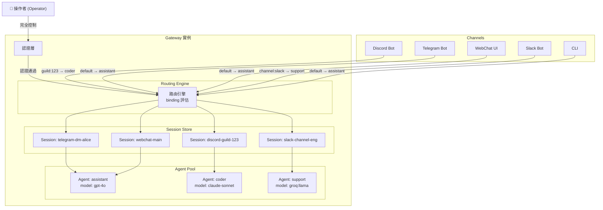

# 操作者信任模型與 Session 生命週期

> **摘要**：OpenClaw 採用**單操作者（Single Operator）**信任模型——一個 Gateway 實例由一個受信任的人類操作者完全控制。這不是多租戶（Multi-tenant）系統。已認證的呼叫者即為該 Gateway 的受信任操作者，擁有完整的控制權。Session 是操作者與 Agent 之間的對話容器，每個 Session 由一個 session key 唯一標識，可以跨多個 Channel 存在。同一個 Gateway 可以運行多個 Agent，每個 Agent 可以同時服務多個 Channel，而路由引擎根據 binding 配置決定哪些訊息送到哪個 Agent。

---

## 1. 信任模型：一個操作者控制一切

### 1.1 核心安全假設

OpenClaw 的信任模型在 SECURITY.md 中有明確的定義：

> "Authenticated callers are treated as trusted operators for that gateway instance."
>
> — `source-repo/SECURITY.md:95-100`

這是整個系統安全模型的基石。讓我們逐一拆解：

**什麼是操作者（Operator）？**

操作者是安裝和運行 OpenClaw Gateway 的那個人。在最典型的場景中，這就是你——在自己的筆電或伺服器上跑 Gateway 的那個人。

**操作者擁有什麼權限？**

一切。操作者對 Gateway 有完整的控制權：

- 讀取和修改所有配置
- 存取所有 Session 的對話歷史
- 執行任何工具呼叫
- 管理所有 Channel 連接
- 安裝和移除 Plugin

**認證等於操作者**

關鍵的設計決策是：通過認證的呼叫者 = 操作者。不存在「只讀」或「受限」的存取層級。

```
// source-repo/SECURITY.md:95-119
// 本地 localhost WebSocket sessions + 共享 gateway secret = 完整操作者能力
// HTTP 相容端點 (/v1/chat/completions 等) + 共享 secret = 完整操作者存取
// Session identifiers (sessionKey, IDs, labels) = 路由控制，不是授權邊界
```

> — `source-repo/SECURITY.md:95-119`

### 1.2 認證方式

Gateway 支援多種認證方式，但所有方式都授予同等的操作者權限：

```typescript
// source-repo/src/gateway/auth.ts:29-67
ResolvedGatewayAuthMode = "none" | "token" | "password" | "trusted-proxy"

GatewayAuthResult.method =
  | "none"            // 無認證（僅限 loopback）
  | "token"           // Bearer token 認證
  | "password"        // 密碼認證
  | "tailscale"       // Tailscale 身份認證
  | "device-token"    // 裝置配對 token
  | "bootstrap-token" // 初始引導 token
  | "trusted-proxy"   // 受信任反向代理
```

> — `source-repo/src/gateway/auth.ts:29-67`

認證方式的選擇取決於部署情境：

| 認證方式 | 典型場景 | 說明 |
|---------|---------|------|
| `none` | 本地 loopback | Gateway 綁定到 127.0.0.1，不需要認證 |
| `token` | 遠端存取 | 自動生成或手動設定的 Bearer token |
| `password` | 簡易遠端 | 密碼保護 |
| `tailscale` | Tailnet 存取 | 透過 Tailscale 網路身份驗證 |
| `device-token` | 行動 App | 透過裝置配對取得的 token |
| `bootstrap-token` | 初始設定 | 首次配對用的臨時 token |
| `trusted-proxy` | 反向代理 | 信任上游代理的身份標頭 |

Gateway 有認證速率限制來防止暴力攻擊：

```typescript
// source-repo/src/gateway/server.impl.ts:132-145
// 建立認證速率限制器
createGatewayAuthRateLimiters()
// 包含 browser rate limiter 和 optional shared rate limiter
```

> — `source-repo/src/gateway/server.impl.ts:132-145`

```typescript
// source-repo/src/gateway/auth.ts:74-100
AuthorizeGatewayConnectParams {
  rateLimiter         // 速率限制器
  clientIp            // 客戶端 IP
  browserOriginPolicy // 瀏覽器來源策略
}
```

> — `source-repo/src/gateway/auth.ts:74-100`

### 1.3 非多租戶

SECURITY.md 非常明確地指出，OpenClaw **不是**多租戶系統：

> "NOT multi-tenant: One gateway = one trusted operator."
>
> — `source-repo/SECURITY.md:95-97`

這意味著：

- **不支援**多個使用者共用一個 Gateway
- **不支援**不同使用者看到不同的對話
- **不支援**基於角色的存取控制（RBAC）
- Session ID 和 session key 只是**路由控制**，不是授權邊界

如果你需要讓多個人使用 OpenClaw，正確的做法是：

> "For multiple users: separate VPS/host per user."
>
> — `source-repo/SECURITY.md:105-107`

### 1.4 安全範圍外的事項

SECURITY.md 也列出了不在安全範圍內的場景：

```
// source-repo/SECURITY.md:128-149
不視為安全問題的情境：
- 僅限 prompt injection 的攻擊（未突破邊界）
- 在公開網際網路上暴露 Gateway
- 在同一 Gateway 上的互不信任操作者
- 已信任安裝的 Plugin 以 Gateway 權限執行
- 沙箱停用時的 host-side exec（這是文件記載的預設行為）
```

> — `source-repo/SECURITY.md:128-149`

這段清單非常重要，它清楚地界定了 OpenClaw 的安全邊界——系統假設操作者是受信任的，Plugin 是受信任的程式碼，而沙箱預設是關閉的。

---

## 2. Session 的概念與生命週期

### 2.1 什麼是 Session？

Session 是 OpenClaw 中**對話的容器**。每個 Session 代表一段持續的互動——一系列訊息的來回。Session 有以下核心屬性：

- **Session ID**：UUID 格式的唯一識別碼
- **Session Key**：結構化的路由 key，包含 agent、account、peer 等資訊
- **Agent ID**：處理這個 Session 的 Agent
- **Transcript**：對話歷史記錄
- **Label**：人類可讀的標籤

```typescript
// source-repo/src/sessions/session-id.ts:1-6
// Session ID 格式驗證：UUID v4
const SESSION_ID_REGEX = /^[0-9a-f]{8}-[0-9a-f]{4}-[0-9a-f]{4}-[0-9a-f]{4}-[0-9a-f]{12}$/i;

export function looksLikeSessionId(value: string): boolean {
  return SESSION_ID_REGEX.test(value);
}
```

> — `source-repo/src/sessions/session-id.ts:1-6`

### 2.2 Session Key 的結構

Session key 是理解 OpenClaw 路由的關鍵。它不是隨機的 UUID，而是一個結構化的字串，編碼了路由資訊：

```typescript
// source-repo/src/sessions/session-key-utils.ts:1-149
// Session key 解析函式集：

parseAgentSessionKey()
// 格式："agent:AGENT_ID:REST"（不區分大小寫）

isCronRunSessionKey()
// 格式："cron:X:run:Y"（定時任務 Session）

isCronSessionKey()
// 格式："cron:*"（定時任務前綴）

isSubagentSessionKey()
// 包含 ":subagent:" 標記

getSubagentDepth()
// 計算 ":subagent:" 出現次數

isAcpSessionKey()
// 格式："acp:*"（ACP/IDE Session）

parseThreadSessionSuffix()
// 提取 ":thread:THREAD_ID" 後綴

parseRawSessionConversationRef()
// 解析 "channel:kind:id" 對話參考
```

> — `source-repo/src/sessions/session-key-utils.ts:1-149`

Session key 的結構揭示了 OpenClaw 的 Session 種類：

| Session 種類 | Key 格式 | 說明 |
|-------------|---------|------|
| 標準對話 | `agent:AGENT_ID:channel:account:peer` | 來自 Channel 的對話 |
| 執行緒 | `...original_key...:thread:THREAD_ID` | 討論串中的子對話 |
| 定時任務 | `cron:CRON_ID:run:RUN_ID` | Cron job 執行的 Session |
| ACP/IDE | `acp:...` | IDE 整合的 Session |
| 子代理 | `...parent...:subagent:CHILD` | 子 Agent 的 Session |

### 2.3 Session 生命週期事件

Session 有明確的生命週期事件：

```typescript
// source-repo/src/sessions/session-lifecycle-events.ts:1-28
SessionLifecycleEvent {
  sessionKey       // Session 的路由 key
  reason           // 觸發原因
  parentSessionKey?// 父 Session（如子代理）
  label?           // 人類可讀標籤
  displayName?     // 顯示名稱
}

onSessionLifecycleEvent(listener)   // 註冊監聽器，回傳取消訂閱函式
emitSessionLifecycleEvent(event)    // 發射事件給所有監聽器（含錯誤隔離）
```

> — `source-repo/src/sessions/session-lifecycle-events.ts:1-28`

生命週期遵循這個流程：

```
建立 (Create)
    ↓
啟用 (Activate) — 訊息開始流入
    ↓
執行中 (Active) — Agent 處理對話
    ↓         ↗ （新訊息再次啟用）
閒置 (Idle) —
    ↓
歸檔 (Archive) — 寫入持久化儲存
    ↓
關閉 (Close) — 釋放記憶體
```

Session 的持久化和歸檔由 Gateway 管理：

```
source-repo/src/gateway/ 中與 Session 相關的檔案：
- session-*.ts    Session 持久化與歸檔
```

> — `source-repo/src/gateway/` 目錄

### 2.4 Session 與 Channel 的關係

一個 Session 可以只綁定到一個 Channel，也可以在 CLI/WebChat 等通用介面中存在。Session key 中的 channel 和 account 資訊決定了這個對應關係。

---

## 3. 多 Channel 同時連接

### 3.1 Channel 的啟動與管理

Gateway 啟動時，會根據配置啟動所有已配置的 Channel。每個 Channel 是一個獨立的運行時實例：

```typescript
// source-repo/src/gateway/server-channels.ts:33-57
ChannelRuntimeStore {
  aborts              // 中止控制器集合
  startingPromises    // 啟動中的 Promise
  tasks               // 背景任務
  runtimes            // 運行時實例
}
```

> — `source-repo/src/gateway/server-channels.ts:33-57`

每個 Channel 帳號有獨立的啟用狀態檢查：

```typescript
// source-repo/src/gateway/server-channels.ts:59-65
isAccountEnabled()    // 檢查帳號是否啟用
```

> — `source-repo/src/gateway/server-channels.ts:59-65`

Channel 的停止有優雅的超時機制：

```typescript
// source-repo/src/gateway/server-channels.ts:76-99
waitForChannelStopGracefully()  // 超時式優雅停止
```

> — `source-repo/src/gateway/server-channels.ts:76-99`

### 3.2 同一 Agent 服務多個 Channel

OpenClaw 的路由系統允許同一個 Agent 同時服務多個 Channel。例如，你可以配置一個 Agent 同時接收來自 Discord、Telegram 和 WhatsApp 的訊息。

路由的決定因素是 **binding**（綁定）配置。如果一個 Agent 的 binding 涵蓋了多個 Channel，它就會同時服務這些 Channel。

每個 Channel 的訊息會被正規化為統一格式，然後送到同一個 Agent。Agent 不需要知道訊息來自哪個平台——這是 Channel 層的抽象。

### 3.3 同一 Channel 多帳號

OpenClaw 支援同一個 Channel 類型的多個帳號。例如，你可以同時運行兩個 Discord bot，各自連接到不同的 server。每個帳號有獨立的配置和認證。

```typescript
// source-repo/src/gateway/server-channels.ts:101-118
applyDescribedAccountFields()  // 合併 Channel 帳號元資料
```

> — `source-repo/src/gateway/server-channels.ts:101-118`

### 3.4 Channel 健康監控

Gateway 對每個 Channel 進行健康監控，包含自動重啟策略：

```typescript
// source-repo/src/gateway/server-channels.ts:22-28
// Channel 重啟策略：指數退避
// 初始：5 秒
// 最大：5 分鐘
// 倍數：2
```

> — `source-repo/src/gateway/server-channels.ts:22-28`

---

## 4. 多 Agent 配置

### 4.1 Agent 定義

一個 Gateway 可以運行多個 Agent。每個 Agent 在配置檔的 `agents.list` 陣列中定義：

```typescript
// source-repo/src/config/types.agents.ts:65-113
AgentConfig {
  id                // 唯一 ID（必填）
  default?          // 是否為預設 Agent
  name?             // 顯示名稱
  workspace?        // 獨立工作空間
  model?            // 使用的模型（如 "anthropic:claude-sonnet-4-20250514"）
  thinkingDefault?  // 推理模式預設
  skills?           // 允許的技能集
  memorySearch?     // 記憶搜尋配置
  identity?         // 人格設定（系統提示詞）
  subagents?        // 子代理策略
  sandbox?          // 沙箱覆寫
  tools?            // 工具配置
  runtime?          // 運行時類型
}
```

> — `source-repo/src/config/types.agents.ts:65-113`

### 4.2 Agent 範圍解析

系統透過 `agent-scope.ts` 解析和管理 Agent：

```typescript
// source-repo/src/agents/agent-scope.ts:66-100
listAgentEntries()       // 從配置篩選 Agent 清單
listAgentIds()           // 取得正規化的 Agent ID 清單
                          // 若清單為空，預設為 DEFAULT_AGENT_ID
resolveDefaultAgentId()  // 找到 default=true 的 Agent
                          // 若有多個 default，發出警告
```

> — `source-repo/src/agents/agent-scope.ts:66-100`

### 4.3 不同 Agent 的個別配置

每個 Agent 可以有完全不同的配置：

- **不同的模型**：一個 Agent 用 GPT-4o，另一個用 Claude Sonnet
- **不同的工具**：一個 Agent 有瀏覽器控制，另一個只有文字工具
- **不同的人格**：不同的系統提示詞和群聊行為
- **不同的技能集**：不同的 SKILL.md 允許清單
- **不同的沙箱策略**：一個在沙箱中執行，另一個直接在 host 上
- **不同的運行時**：一個是 embedded，另一個是 ACP（外部 harness）

```typescript
// source-repo/src/config/types.agents.ts:23-30
AgentRuntimeConfig = "embedded" | "acp"

// "embedded" — Agent 邏輯直接在 Gateway 內執行
// "acp"      — Agent 透過 ACP 協定與外部 harness 通訊
```

> — `source-repo/src/config/types.agents.ts:23-30`

### 4.4 AgentsConfig 結構

```typescript
// source-repo/src/config/types.agents.ts:115-118
AgentsConfig {
  defaults?  // 所有 Agent 的預設配置
  list?      // Agent 配置陣列
}
```

> — `source-repo/src/config/types.agents.ts:115-118`

`defaults` 提供了所有 Agent 共享的預設值，個別 Agent 可以覆寫。

---

## 5. Agent 路由（Routing）

### 5.1 路由是什麼問題？

當一則訊息從 Channel 進入 Gateway 時，系統需要決定：

1. 這則訊息應該由哪個 **Agent** 處理？
2. 應該關聯到哪個 **Session**？
3. 來自哪個 **Account**？

這就是路由引擎（Routing Engine）的職責。

### 5.2 路由輸入

路由引擎接收以下輸入：

```typescript
// source-repo/src/routing/resolve-route.ts:27-38
ResolveAgentRouteInput {
  cfg: OpenClawConfig    // 完整配置
  channel: string         // Channel ID（如 "discord"）
  accountId?: string      // Channel 帳號 ID
  peer?: RoutePeer        // DM 對話的對方
  parentPeer?: RoutePeer  // 討論串父訊息的對方（用於 binding 繼承）
  guildId?: string        // Discord guild ID
  teamId?: string         // Teams team/channel ID
  memberRoleIds?: string[]// Discord 角色列表（用於角色型路由）
}

RoutePeer = { kind: ChatType; id: string }
```

> — `source-repo/src/routing/resolve-route.ts:19-38`

### 5.3 路由輸出

路由引擎產出：

```typescript
// source-repo/src/routing/resolve-route.ts:40-61
ResolvedAgentRoute {
  agentId: string          // 目標 Agent ID
  channel: string           // Channel ID
  accountId: string         // Account ID
  sessionKey: string        // 持久化 Session Key
  mainSessionKey: string    // DM 折疊別名
  lastRoutePolicy: "main" | "session"  // 最後路由更新策略
  matchedBy:               // 命中的匹配方式
    | "binding.peer"           // 精確 peer 匹配
    | "binding.peer.parent"    // 父 peer 匹配（討論串）
    | "binding.peer.wildcard"  // 萬用 peer 匹配
    | "binding.guild+roles"    // Guild + 角色匹配
    | "binding.guild"          // Guild 匹配
    | "binding.team"           // Team 匹配
    | "binding.account"        // Account 匹配
    | "binding.channel"        // Channel 匹配
    | "default"                // 預設 Agent
}
```

> — `source-repo/src/routing/resolve-route.ts:40-61`

### 5.4 路由演算法

路由演算法按照**優先順序**評估 binding：

```
1. binding.peer           — 精確 DM 對方匹配（最高優先）
2. binding.peer.parent    — 討論串父訊息的對方
3. binding.peer.wildcard  — 萬用 peer 匹配
4. binding.guild+roles    — Discord guild + 成員角色組合
5. binding.guild          — Discord guild 匹配
6. binding.team           — Teams team 匹配
7. binding.account        — Channel 帳號匹配
8. binding.channel        — Channel 類型匹配
9. default                — 預設 Agent（最低優先）
```

> — 根據 `source-repo/src/routing/resolve-route.ts:170-310` 的 binding index 結構推導

路由引擎使用兩層快取來加速：

```typescript
// source-repo/src/routing/resolve-route.ts:204-215
// evaluatedBindingsCacheByCfg — 最多 2000 個 key
// resolvedRouteCacheByCfg     — 最多 4000 個 key
// 都以 config object + binding ref + session ref 為 key
```

> — `source-repo/src/routing/resolve-route.ts:204-215`

主要的匯出函式：

```typescript
// source-repo/src/routing/resolve-route.ts:632
export function resolveAgentRoute(
  input: ResolveAgentRouteInput
): ResolvedAgentRoute
```

> — `source-repo/src/routing/resolve-route.ts:632`

### 5.5 Binding 配置

Binding 是路由規則的配置單元：

```typescript
// source-repo/src/config/types.agents.ts:32-48
AgentBindingMatch {
  channel      // Channel ID
  accountId?   // Account ID
  peer?        // DM 對方
  guildId?     // Guild ID
  teamId?      // Team ID
  roles?       // 角色列表
}

AgentRouteBinding {
  agentId      // 目標 Agent
  match        // 匹配條件
  comment?     // 註解
}
```

> — `source-repo/src/config/types.agents.ts:32-48`

binding 的管理透過：

```typescript
// source-repo/src/routing/bindings.ts:18-115
listBindings(cfg)                        // 列出所有 binding
resolveNormalizedBindingMatch()           // 驗證和正規化 binding
listBoundAccountIds(cfg, channelId)       // 取得 Channel 的所有綁定帳號
resolveDefaultAgentBoundAccountId()       // 取得預設 Agent 的帳號
buildChannelAccountBindings()             // 建構三層映射：channel → agent → accounts[]
resolvePreferredAccountId()               // 選擇偏好的帳號
```

> — `source-repo/src/routing/bindings.ts:18-115`

### 5.6 路由實例

假設你有以下配置：

```json
{
  "agents": {
    "list": [
      { "id": "assistant", "default": true, "model": "openai:gpt-4o" },
      { "id": "coder", "model": "anthropic:claude-sonnet-4-20250514" }
    ]
  },
  "bindings": [
    { "agentId": "coder", "match": { "channel": "discord", "guildId": "123456" } },
    { "agentId": "assistant", "match": { "channel": "telegram" } }
  ]
}
```

路由行為：

| 訊息來源 | 匹配方式 | 目標 Agent |
|---------|---------|-----------|
| Discord guild 123456 的訊息 | `binding.guild` | `coder` |
| Discord 其他 guild 的訊息 | `default` | `assistant` |
| Telegram 的訊息 | `binding.channel` | `assistant` |
| WebChat 的訊息 | `default` | `assistant` |

---

## 6. Presence 管理：Agent 在各 Channel 的狀態

### 6.1 Channel 層的狀態管理

每個 Channel Extension 負責管理 Agent 在該平台上的「存在感」（Presence）。這包括：

- **Typing Indicator**：Agent 正在「輸入中」的狀態

```typescript
// source-repo/src/channels/typing.ts
// Typing indicator 狀態機
```

> — `source-repo/src/channels/typing.ts`

- **Status Reactions**：用 emoji 反應表示處理狀態

```typescript
// source-repo/src/channels/status-reactions.ts
// 狀態 emoji/reaction 更新
```

> — `source-repo/src/channels/status-reactions.ts`

- **Ack Reactions**：確認已收到訊息

```typescript
// source-repo/src/channels/ack-reactions.ts
// 確認處理
```

> — `source-repo/src/channels/ack-reactions.ts`

### 6.2 Channel 配置與存取控制

每個 Channel 有精細的存取控制：

```typescript
// source-repo/src/channels/allowlist-match.ts
// 發送者允許清單執行

// source-repo/src/channels/allow-from.ts
// 允許/拒絕策略

// source-repo/src/channels/command-gating.ts
// 命令存取控制
```

> — `source-repo/src/channels/` 目錄

這意味著你可以控制：

- 哪些人可以與 Agent 對話（allowlist）
- 哪些命令可以在哪個 Channel 使用（command gating）
- Agent 在群聊中的回應策略

---

## 7. 與多租戶模型的根本差異

### 7.1 傳統多租戶 vs. OpenClaw 單操作者

| 面向 | 多租戶 SaaS | OpenClaw 單操作者 |
|------|-----------|-----------------|
| **使用者數量** | 多個獨立使用者 | 一個操作者 |
| **資料隔離** | 每個租戶的資料相互隔離 | 所有資料對操作者可見 |
| **存取控制** | RBAC、權限矩陣 | 認證 = 完整存取 |
| **Session 邊界** | 安全邊界 | 路由控制（非安全邊界） |
| **信任模型** | 不信任使用者 | 完全信任操作者 |
| **帳單** | 每租戶計費 | 操作者自帶 API key |
| **Plugin 信任** | 沙箱隔離 | Plugin = 受信任程式碼 |
| **水平擴展** | 多實例共享狀態 | 單實例、本地狀態 |

### 7.2 為什麼選擇單操作者？

OpenClaw 的設計哲學是成為**個人 AI 助理**，而非企業平台。這個選擇帶來的好處：

1. **簡化安全模型**：不需要複雜的 RBAC 和多租戶隔離
2. **本地優先**：資料留在操作者的機器上
3. **完全控制**：操作者對系統有完整的可見性和控制力
4. **低延遲**：不需要經過雲端的認證和路由
5. **隱私**：對話不會離開操作者的設備

### 7.3 多 Agent 不等於多租戶

一個常見的誤解是：多個 Agent = 多個使用者。事實並非如此。

多個 Agent 是同一個操作者的不同「分身」。操作者可以建立一個擅長程式設計的 Agent、一個擅長寫作的 Agent、一個處理客服的 Agent——但它們都在同一個信任邊界內，由同一個操作者管理。

Session ID 和 session key 只是**路由控制**。知道一個 session key 不等於「入侵」了那個 Session——因為任何已認證的呼叫者本來就能存取所有 Session。

```
// source-repo/SECURITY.md:105-107
// Session identifiers (sessionKey, IDs, labels) = 路由控制，不是授權邊界
```

> — `source-repo/SECURITY.md:105-107`

---

## 8. 運作模型總結圖



這個圖展示了：

1. **一個操作者**透過認證層完全控制 Gateway
2. **多個 Channel** 同時連接，各自帶來訊息
3. **路由引擎**根據 binding 配置將訊息路由到正確的 Session
4. **每個 Session** 關聯到一個特定的 Agent
5. **多個 Agent** 各自有不同的模型和能力

---

## 引用來源

| 來源檔案 | 行號範圍 | 引用內容 |
|---------|---------|---------|
| `source-repo/SECURITY.md` | 95-119 | 操作者信任模型核心定義 |
| `source-repo/SECURITY.md` | 105-107 | 多使用者建議、Session ID 非授權 |
| `source-repo/SECURITY.md` | 128-149 | 安全範圍外事項 |
| `source-repo/src/gateway/auth.ts` | 29-67 | 認證方式定義 |
| `source-repo/src/gateway/auth.ts` | 74-100 | 認證參數型別 |
| `source-repo/src/gateway/server.impl.ts` | 132-145 | 認證速率限制器 |
| `source-repo/src/gateway/server-channels.ts` | 22-28 | Channel 重啟策略 |
| `source-repo/src/gateway/server-channels.ts` | 33-65 | Channel 運行時管理 |
| `source-repo/src/gateway/server-channels.ts` | 76-118 | Channel 停止與帳號管理 |
| `source-repo/src/sessions/session-id.ts` | 1-6 | Session ID 格式 |
| `source-repo/src/sessions/session-key-utils.ts` | 1-149 | Session key 解析 |
| `source-repo/src/sessions/session-lifecycle-events.ts` | 1-28 | 生命週期事件 |
| `source-repo/src/config/types.agents.ts` | 23-30 | Agent runtime 型別 |
| `source-repo/src/config/types.agents.ts` | 32-48 | Binding 配置型別 |
| `source-repo/src/config/types.agents.ts` | 65-118 | Agent 配置結構 |
| `source-repo/src/agents/agent-scope.ts` | 66-100 | Agent 範圍解析 |
| `source-repo/src/routing/resolve-route.ts` | 19-61 | 路由輸入/輸出型別 |
| `source-repo/src/routing/resolve-route.ts` | 170-310 | Binding index 與路由演算法 |
| `source-repo/src/routing/resolve-route.ts` | 204-215 | 路由快取策略 |
| `source-repo/src/routing/resolve-route.ts` | 632 | 主要匯出函式 |
| `source-repo/src/routing/bindings.ts` | 18-115 | Binding 管理函式 |
| `source-repo/src/channels/` | 目錄 | Channel 存取控制 |
